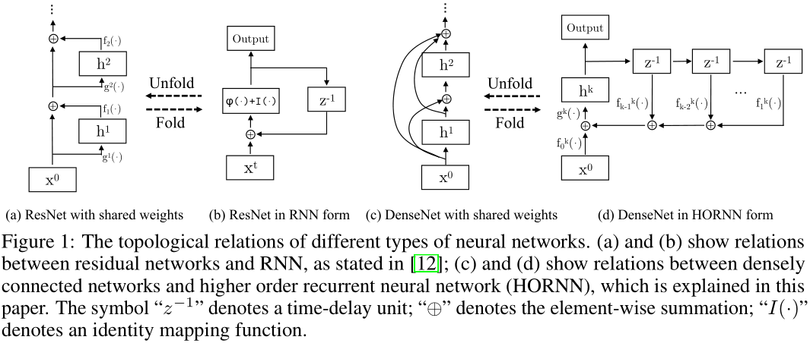
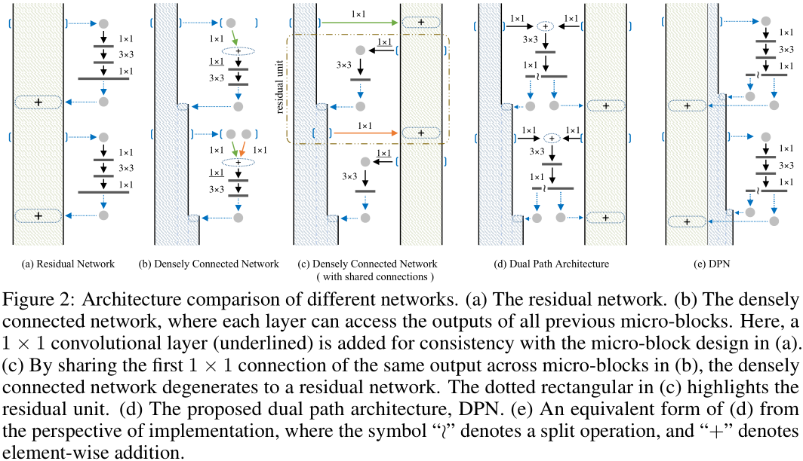
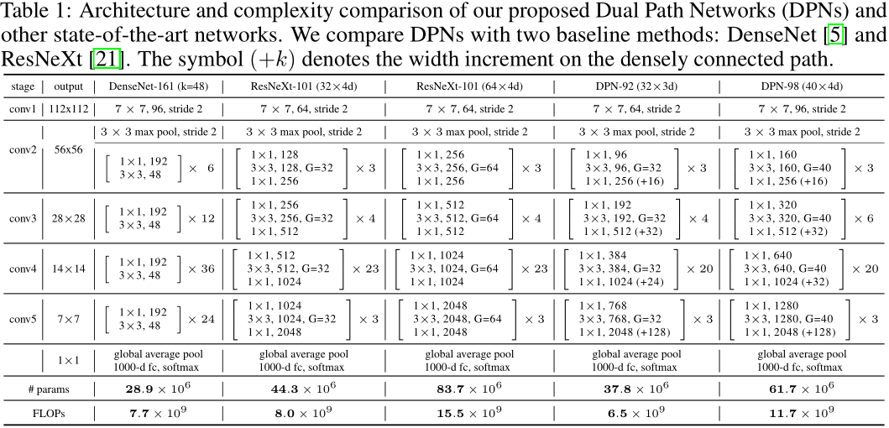
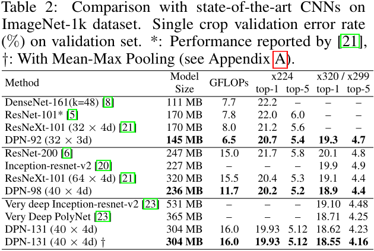
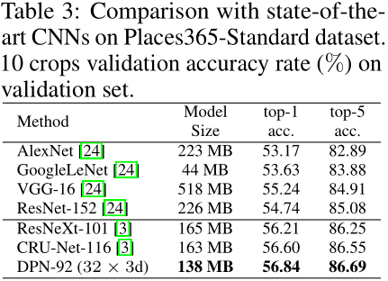
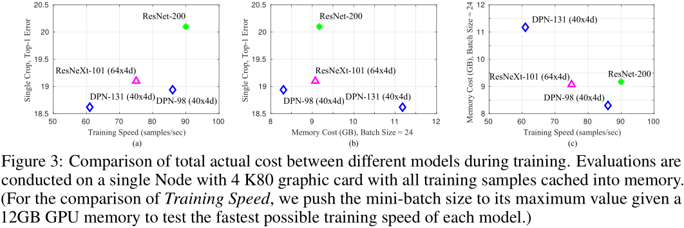
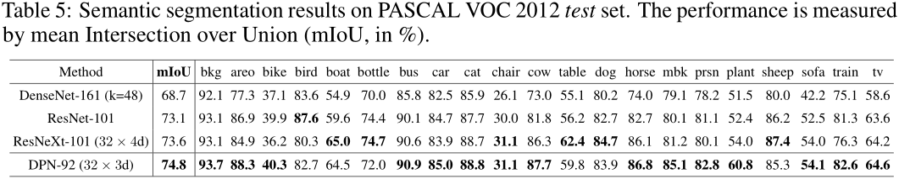
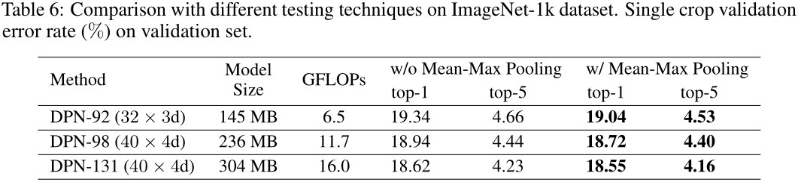

# DPN
[Dual Path Networks](https://arxiv.org/abs/1707.01629)  
Yunpeng Chen, Jianan Li, Huaxin Xiao, Xiaojie Jin, Shuicheng Yan, Jiashi Feng  

### 摘要
本文提出一种简单高效且高度模块化的双路网络（Dual Path Networks，DPN），提出了一种新的网络内部连接的拓扑结构。
通过考察ResNet和DenseNet与HORNN（higher order recurrent neural network）之间的等价性，我们发现ResNet可以重复利用网络中的特征，
而DenseNet可以探索新的特征，这两个特性都有助于网络学习到好的表示。本文提出的双路网络既可以共享网络特征，也拥有探索新特征的能力，
综合了上面两个最先进网络的优点。在ImagNet-1k、Places365和PASCAL VOC数据集上的大量实验证明DPN的性能优于之前的最先进的网络，
特别是在ImagNet-1k数据集上，一个浅层DPN（模型规模小26%、计算复杂度少25%、内存消耗低8%）的性能超过ResNeXt-101(64x4d)，
一个更深层的DPN（DPN-131）相比于最先进的单模型性能提升更多，但训练速度却要快2倍左右。其他数据集上的实验也证明DPN在多个应用上的性能要优于
ResNet、DenseNet和ResNeXt。  

### 1. Introduction
本文的目标是开发一种新的深层网络中的连接拓扑结构，主要聚焦于跳跃连接（skip connection），这种连接方式广泛应用于现代的深度神经网络中。
跳跃连接使得输入信息可以直接传输到后面的层，而梯度可以直接反传到前面的层，有效缓解了梯度消失问题，网络也更易于优化。  
深度残差网络（Deep Residual Network，[ResNet](https://github.com/binLearning/caffe_toolkit/tree/master/ResNet)）
是成功使用跳跃连接的网络之一，它将不同block（即残差函数）用跳跃连接直接相连，这种跳跃连接在ResNet中被称为残差路径（residual path），
残差路径的输出和残差函数的输出通过加法操作结合，形成一个残差单元。在ResNet也发展出了多种架构，
比如[WRN](https://github.com/binLearning/caffe_toolkit/tree/master/WRN)、Inception-resnet、
[ResNeXt](https://github.com/binLearning/caffe_toolkit/tree/master/ResNeXt)等。  
不同于ResNet通过残差路径将输入特征和输出特征相加，最近发表的密集卷积网络（Dense Convolutional Network，
[DenseNet](https://github.com/binLearning/caffe_toolkit/tree/master/DenseNet)）
使用密集连接路径（densely connected path）将输入特征与输入特征相连接，使得每一个block可以得到之前所有block的原始信息（注：同属一个stage）。
本文主要研究ResNet和DenseNet各自的优点以及局限性，然后提出一种新的路径设计方式——双路径架构。
通过考察DenseNet与HORNN之间的关系从另一个角度理解DenseNet，并且考察ResNet与DenseNet之间的关系。经过上述研究我们发现，
深度残差网络通过残差路径隐式的对特征进行重复使用，而密集连接网络通过密集连接路径可以持续探索新的特征。  
双路网络DPN继承了上面两个网络的优点，可以对特征进行再利用（re-usage）、再开发（re-exploitation）。DPN也有参数利用率高、
计算复杂度低、内存消耗少、易于优化的优点。  

### 2. Related work
AlexNet和VGG是两个非常重要的网络，它们显示了深层卷积神经网络的能力，并且指出使用极小的卷积核（3x3）可以提高神经网络的学习能力。
ResNet中使用了跳跃连接，极大减缓了优化难度并提高了模型性能，后续也有很多基于ResNet的网络架构。DenseNet通过沿通道维度串联的方式连接输入/输出特征，
所以密集连接路径的宽度会随着深度的增加而线性增加，所需的参数量平方增加，如果程序实现没有针对性的优化就会消耗很大的GPU显存，
这就限制了通过加深或增宽DenseNet来进一步提升模型准确率。  
[ResNet-v2](https://github.com/binLearning/caffe_toolkit/tree/master/ResNet-v2)显示了残差路径（恒等映射）对于缓解优化问题的重要性。
也有工作考察ResNet与RNN的关系，与其相似，本文考察了DenseNet与HORNN的关系。  

### 3. Revisiting ResNet, DenseNet and Higher Order RNN
首先将DenseNet和HORNN进行类比，然后简化DenseNet到ResNet，如图1所示：  
  
最后得出结论：ResNet可以促进特征重复使用，减少特征冗余；DenseNet可以探索新的特征，但存在冗余问题。  

### 4. Dual Path Networks
#### 4.2 Dual Path Networks
具体如图2所示，将ResNet和DenseNet结合起来。实际实现的时候用ResNeXt来代替ResNet作为主体，然后使用“slice layer”和“concat layer”
添加额外的DenseNet的路径，最终得到DPN网络。  
  
DPN与DenseNet、ResNeXt的网络架构配置以及复杂度见表1。  
  

### 5. Experiments
DPN在不同任务不同数据集上的表现如下：  
  
  
  
  
  
  
