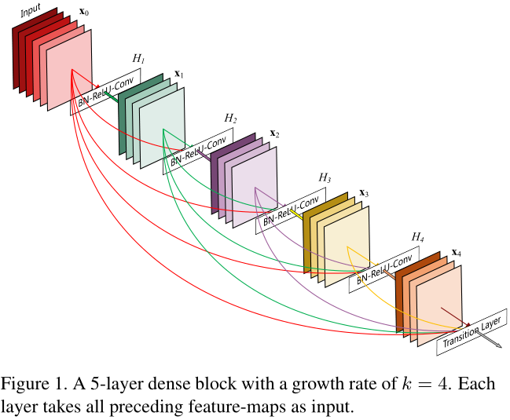
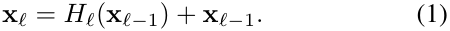
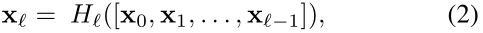
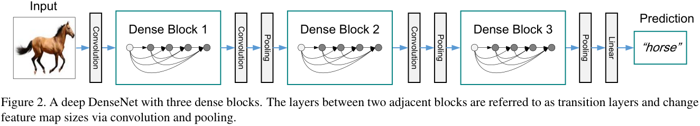
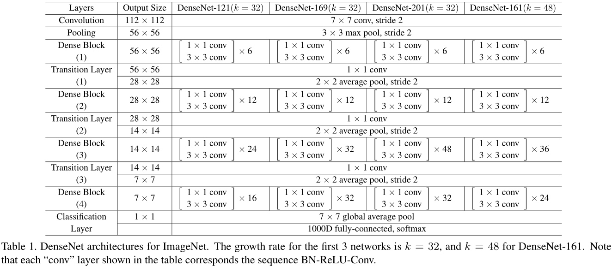
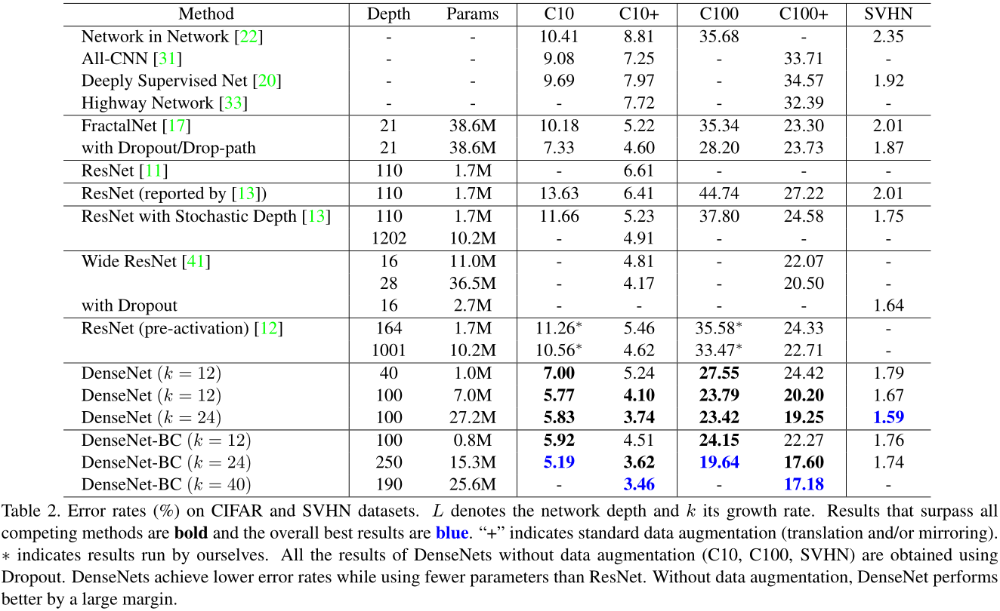
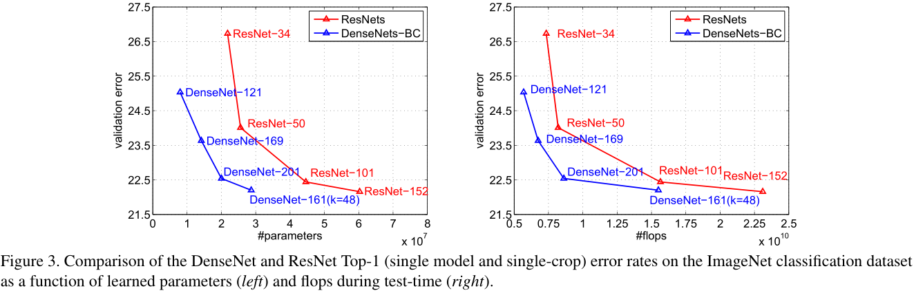
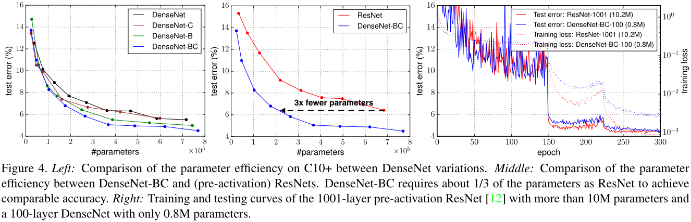
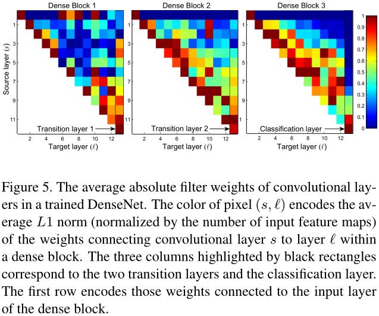

# DenseNet
[Densely Connected Convolutional Networks](https://arxiv.org/abs/1608.06993)  
Gao Huang, Zhuang Liu, Kilian Q. Weinberger, Laurens van der Maaten  

### 摘要
近期的一些工作表明，如果在网络层之间加上快捷连接（shorter connections），那么卷积网络可以设计得更深层、取得更高的准确率、训练也更高效。
本文提出一种密集卷积网络（Dense Convolutional Network，DenseNet），网络中的层会与它之前的所有层直接连接。具有L层的传统卷积网络中有L条连接，
而DenseNet中有L(L+1)/2条直接连接线路。对于网络中的每一层，在它之前的所有层所生成的特征图（feature-maps）都会作为该层的输入。
DenseNet的优点有：缓解梯度消失问题，增强特征在网络中的传输，特征可重复利用，大幅降低网络参数数量。我们在四个benchmark数据集
（CIFAR-10，CIFAR-100，SVHN and ImageNet）上评估网络性能，DenseNet相比于之前的大多数先进网络都有较大提升。官方实现（Caffe）的源码地址：
https://github.com/liuzhuang13/DenseNetCaffe 。  

### 1. Introduction
CNN在最近才真正是“深度”网络，Hightway Networks和ResNet是最早突破100层的网络架构。随着网络深度的增加，一个新问题出现了：
输入的信息或者反传的梯度在经过多个网络层之后可能会消失。最近的多项工作都可以用来解决这个问题，比如ResNet、Hightway Networks、
随机深度的ResNet、FractalNet等，这些网络架构都有一个共同点：层之间都有直连的线路。  
本文提出一种新的连接方式：为了最大化网络层间的信息传输，所有层（具有相同特征图空间尺寸）均加上快捷连接，如图1所示。  
  
ResNet使用加法操作来连接不同分支的输出，而DenseNet使用沿通道维度串联的方式来整合输出。由于这种密集的连接方式，我们称本文的网络为
Dense Convolutional Network（DenseNet）。  
DenseNet需要的参数规模比传统的卷积网络更小，这是因为它不需要重新学习那些冗余的特征图。传统的前馈架构可以视作带状态的算法，
状态在层间进行传递。每一层都会对状态做一些变化，但也会保留一些必要的信息。ResNet将这些需要保留的信息直接通过恒等映射进行传输，
[deep networks with stochastic depth](https://arxiv.org/abs/1603.09382)展示了ResNet中的很多层对最终的结果影响极小，
可以在训练时随机丢弃部分层。如此一来ResNet中的状态和（展开的）RNN就很相似，但是ResNet中每一层的参数不是共享的，所以中的参数量要大得多。
DenseNet将每一层新添加的信息和需要保留的信息区分开来。DenseNet中的层可以很精简（比如每一层只产生12个特征图），
每层只添加少量的特征图到网络的“集体知识（collective knowledge）”中，其余的特征图保存不变，分类器最终的决策依赖于网络中的所有特征图。  
除了对参数的有效利用之外，DenseNet还有一个很大的优点，它可以改进信息和梯度在网络中的传输，使得网络更易于优化。
每一层都可以直接得到损失函数的梯度以及原始的输入信号，就像隐式的深度监督（deep supervision）。这有助于训练更深层的网络。
另外我们还发现密集连接有一定的正则化效果，在训练集规模比较小时可以避免过拟合。  

### 2. Related Work
FCN等网络通过快捷连接（skip-connnection）将网络中的多级特征进行组合，可有效提升网络性能。AdaNet也提出一种跨层连接的网络架构。
Highway Network是第一个可以有效训练超过100层的网络结构。ResNet将Highway Network中的门限分路直接改为恒等映射，
在多个计算机视觉领域取得极大的性能提升。随机深度ResNet通过随机丢弃部分层来改进训练过程，成功训练了超过1000层的网络，
这个工作说明并不是所有层都是必须的，也就是说深度残差网络中存在着大量冗余，DenseNet的部分灵感来自于这个观察。
预激活（pre-activation）的ResNet（[ResNet-v2](https://github.com/binLearning/caffe_toolkit/tree/master/ResNet-v2)）
也可以训练出超过1000层的网络。  
除了增加网络深度外，还有一些网络是从增加网络宽度入手。GoogLeNet中的Inception模块将不同尺寸卷积核产生的特征图相连接作为输出。
Resnet in Resnet (RiR)提出了一种更宽的残差block。Wide Residual Networks(WRN)展示了只要残差网络深度足够，
通过简单的每层的增加滤波器数量就可以提高网络性能。FractalNet使用更宽的网络结构也取得了很好的效果。  
不同于从极深/宽的网络中获取更强的表示能力，DenseNet致力于探索特征重复使用（feature reuse）的潜力，同时使用精简的网络，
使得模型更易于优化并且具有很高的参数利用率。连接不同层所产生的特征图可以增加后续层输入的多样性并提高效率，这是与ResNet最大的不同之处。
Inception网络也是连接不同层所产生的特征图，但是DenseNet更加简单高效。  
还有一些网络架构也有很好的性能，比如Network in Network (NIN)、Deeply Supervised Network (DSN)、Ladder Networks、
Deeply-Fused Nets (DFNs)等。

### 3. DenseNets
**ResNets**  
ResNet在层间中加入一个恒等映射的快捷连接：  
  
ResNet的优点是后面层中的梯度可以通过恒等函数直接传输到前面的层。但是 **ResNet中恒等连接的输出与残差函数的输出通过加法操作进行连接，
可能会影响网络中的信息流动** 。  
**DenseNet**  
DenseNet中的每一层与它所有的后续层都有直接连接，如图1所示，也就是说每一层的输入包含它之前所有层所产生的特征图：  
  
为了便于实现，将公式(2)中的输入连接为一个单独的张量。  
**Composite function**  
与ResNet-v2中一样，残差函数由单个连续操作组成：batch normalization (BN)，rectified linear unit (ReLU)，3×3 convolution (Conv)。  
**Pooling layers**  
DenseNet将网络分为多个密集连接的dense block，如图2所示，每个block之间加入一个transition layer用于改变特征图尺寸，
transition layer由batch normalization (BN)，1x1 convolution (Conv)，2×2 average pooling组成。  
  
**Growth rate**  
引入一个新的超参数growth rate，表示每个残差函数H产生的特征图数量，本文中以k表示。为了防止网络太宽并提高参数利用率，
k的取值不应太大，一般12,16即可。可以将特征图视为网络的全局状态，每层都会新添加k个特征图，那么growth rate就可以
控制每一层可以向全局状态中添加多少新的信息。  
**Bottleneck layers**  
虽然每一层只产生k个特征图，但加起来的总量是很可观的，导致后续层的输入量太大。本文使用bottleneck layer（1x1-3x3-1x1）来解决这一问题。
第一个1x1卷积层可以减少输入特征图的数量，以此来提高计算效率。本文将使用了bottleneck layer的模型表示为DenseNet-B。
除非另有说明，本文所有bottleneck layer中的第一个1x1卷积层将输入特征图减少到4k个。  
**Compression**  
为了进一步精简网络，在transition layer中也减少一定比例的特征图，本文中设置该比例为0.5也就是减少一半的特征图。
本文将同时使用Bottleneck layers和Compression的模型表示为DenseNet-BC。  
**Implementation Details**   
具体见表1。  
  

### 4. Experiments
#### 4.3 Classification Results on CIFAR and SVHN
结果见表2。  
  
**Accuracy**  
250层DenseNet-BC在SVHN上的表现不佳，可能是因为SVHN相对比较简单，极深层的网络出现了过拟合的现象。  
**Capacity**  
DenseNet随着L和k的增大性能也持续提升，说明DenseNet可以加深/宽来提高表示能力，也可以看出DenseNet没有出现过拟合或者优化困难的现象。  
**Parameter Efficiency**  
DenseNet的参数利用率比其他模型更高，尤其是DenseNet-BC。  
**Overfitting**  
参数利用率高的一个正面影响就是DenseNet不易发生过拟合现象，DenseNet-BC也可以避免过拟合。  
#### 4.4 Classification Results on ImageNet
与ResNet的比较见图3。  
  

### 5. Discussion
**Model compactness**  
DenseNet可以重复利用前面层的特征图，并且使用更加精简的模型。图4展示了不同网络的参数使用率。从图中可以看出，DenseNet-BC是参数利用率最高的模型。
这个结果也符合图3中的趋势。图4-right显示了只有0.8M可训练参数的DenseNet-BC性能可以匹敌包含10.2M参数的1001层ResNet。  
  
**Implicit Deep Supervision**  
DenseNet性能的提升也可能得益于隐式的深度监督机制，每一层都可以通过快捷连接直接从损失函数层得到梯度（额外的监督信号）。
deeply-supervised nets (DSN)中解释了深度监督的优势，相比较而言DenseNet中的监督信号更加简单，所有层都是从同一个损失函数层接收梯度。  
**Stochastic vs. deterministic connection**  
DenseNet在一定程度上受到了随机深度ResNet的启发。  
**Feature Reuse**  
DenseNet中的每一层可以接收到它之前的所有层所产生的特征图（有时要经过transition layers）。为了验证网络是否受益于该机制，针对同一block中的每一层，
计算该层与它前面s层输出上的权值的绝对值均值，图5展示了三个dense block中每一层的情况，权值的绝对值均值可以考察该层对之前层的依赖程度。  
  
从图5中可以看出：  
1.同一block中的每一层在多个输入上都有权值。这说明在同一个block中，最早期提取的特征也会被最后的层直接利用到。  
2.transition layers在几乎所有输入上都有权值。这说明DenseNet网络中第一层的信息也可以间接传输到最后一层。  
3.第二和第三个block中的层都在前面transition layers产生的特征上分配了最少的权重。这说明transition layers的输出中有很多冗余特征，
DenseNet-BC通过压缩这些输出获得了更好的性能也说明了这一点。  
4.最终的分类层更多的利用了最后的一些特征图，这可能是因为最后部分的层会生成更高层的特征（更具有区分能力）。  

### 6. Conclusion
本文提出了一种新的卷积网络架构——Dense Convolutional Network (DenseNet)，同一个block中的所有层互联。DenseNet参数规模更小，
计算复杂度更低，但在多个任务上取得了最佳的结果。  
得益于密集连接的方式，DenseNet可以同时具有恒等映射（identity mapping）、深度监督（deep supervision）和深度多样性
（diversified depth）的特性。DenseNet可以重复利用网络中的特征，学习到更简洁、准确率更高的模型。由于它内部表示的简洁以及
对冗余特征的缩减，DenseNet可以在多种计算机视觉任务中作为特征提取器。  
