# ResNeXt
[Aggregated Residual Transformations for Deep Neural Networks](https://arxiv.org/abs/1611.05431)  
Saining Xie, Ross Girshick, Piotr Dollár, Zhuowen Tu, Kaiming He   

### 摘要
本文提出一种高度模块化并易于搭建的网络架构，网络中使用的基本构件（building block）都是一组具有相同拓扑结构的变换的聚合。
这种同结构多分支的设计理念只需要设置很少的超参数。本文提出的策略也引入了一个新的维度——**“基数（cardinality）”**，也就是同属一个block
的变换的数量，这是一个和网络深度、宽度同等重要的因素。通过在ImageNet-1K数据集上的实验可以发现，在保持网络复杂度不变的前提下，
增大基数可以提高分类准确率。另外通过增大基数来提升网络能力比深度、宽度更有效。本文提出的模型称为ResNeXt，是我们参加ILSVRC
2016分类任务时提交的解决方案的基础，另外也在ImageNet-5K和COCO检测数据集上对ResNeXt进行考察，发现ResNeXt的效果要优于相应的ResNet。
官方实现（Torch）的源码地址：https://github.com/facebookresearch/ResNeXt 。  

### 1. Introduction
视觉识别领域的研究正在经历从“特征工程”到“网络工程”的转变。现在研究人员的主要精力转向于设计可以学习到更好的表示的网络架构。  
随着超参数（如宽度（网络层的通道数）、滤波器尺寸、步幅等）数量的增加，设计架构也变得越来越困难。而VGG网络的成功说明使用简单但有效的策略
（堆叠相同结构的基本构件）也可以构建比较深层的网络，这个策略在ResNet中也得以沿用，ResNet中堆叠的block也都是相同的拓扑结构。
简单的设计规则可以减少对超参数的选取，而深度是神经网络中一个至关重要的维度。另外，使用简单的设计规则可以降低所选取的超参数
过度适应某些特定数据集的风险，VGG网络和ResNet网络在多种视觉/非视觉任务上都很鲁棒。  
不同于VGG网络，Inception模型通过精心设计网络的拓扑结构，在保持模型复杂度较低的前提下也取得了很高的准确率。所有Inception模型都具有
一个重要的性质——都是遵循 **拆分-变换-合并（split-transform-merge）** 的设计策略。Inception模型中block的输入会先被拆分成若干低维编码
（使用1x1卷积实现），然后经过多个不同的滤波器（如3x3、5x5等）进行转换，最后通过沿通道维度串联的方式合并。这种设计策略希望在保持
网络计算复杂度相当低的前提下获取与包含大量且密集的层的网络具有相同的表示能力。  
但是，Inception模型实现起来很麻烦，它包含一系列复杂的超参——每个变换的滤波器的尺寸和数量都需要指定，不同阶段的模块也需要定制。
太多的超参数大多的影响因素，如何将Inception模型调整到适合不同的数据集/任务变得很不明晰。  
本文同时借鉴VGG/ResNet网络中重复使用同结构模块以及Inception模型的拆分-变换-合并的策略来简明的构建深层网络，具体见图1-right。
这样的设计可以随意调整变换的规模。  
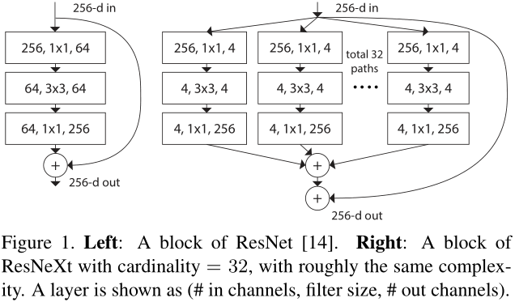  
这种设计策略还有两种等价形式（见图3）。图3(b)中的形式很像Inception-ResNet网络中的模块，不同的是每个分支都具有相同的拓扑结构；
图3(c)与AlexNet中分组卷积（grouped convolutions）的理念相似，然而AlexNet使用分组卷积是受限于当时的硬件条件。  
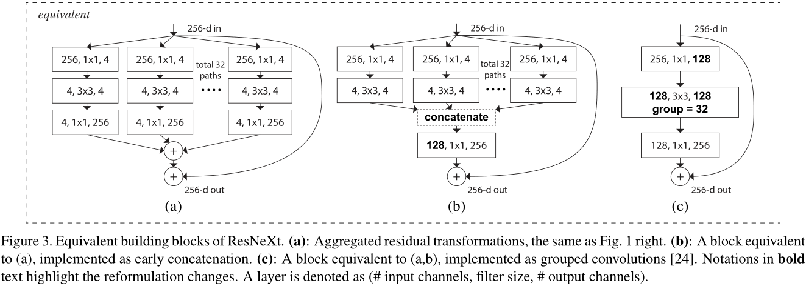  
基数是与深度、宽度同样重要的维度，实验证明通过**增大基数来提升网络性能比深度、宽度更有效**，尤其是当深度/宽度的影响开始出现衰减时。  
本文提出的网络名为ResNeXt，意为next维度（基数）。  

### 2. Related Work
**Multi-branch convolutional networks**   
多分支结构如Inception模型，ResNet可视为两个分支（其中一个是恒等映射），还有树状多分支结构的深度神经决策森林
（Deep neural decision forests）。  
**Grouped convolutions**  
分组卷积可以追溯到AlexNet，将模型拆分放到两个GPU中进行训练。Caffe、Torch等都支持分组卷积，主要也是为了兼容之前的AlexNet。
我们没有发现证明分组卷积可以提高准确率的依据。一个分组卷积的特例是逐通道卷积，它是可分离卷积的一部分。  
**Compressing convolutional networks**  
在空间/通道维度分解网络，减少冗余，可以对网络进行加速或精简。我们的方法具有更高的表示能力，而不着重于压缩。  
**Ensembling**  
综合多个独立训练的网络的预测可有效提高准确率，这种集成的方法在竞赛中被广泛使用。Veit等人（Residual networks behave like 
ensembles of relatively shallow network）指出ResNet网络内部的表现就如同是多个浅层网络的集成，ResNet-v2中的加法操作具有集成的意义。
本文提出的方法也是用加法操作将变换组合聚合成一个深层网络，但是我们觉得认为残差网络的行为像集成学习是不严谨的，因为网络中的成员是同时训练，
而不是独立训练所得。  

### 3. Method
#### 3.1 Template
使用如VGG/ResNet网络相似的高度模块化的设计理念，网络由一系列残差block堆叠而成，并遵循两个简单的规则：(i)如果block输出的特征图的空间尺寸相同，
那么它们具有相同的超参数（宽度、滤波器尺寸等）；(ii)如果特征图的空间维度减半，那么block的宽度（通道数）加倍，
第二条规则确保了所有block的计算复杂度基本相同。  
根据上述两条规则可以设计一个模板模块，网络中的所有模块都可以照此设计。这两条规则也减少了超参数的选择，让我们可以专注于考察几个关键因素即可。
遵循这些规则设计的网络结构如表1所示。  
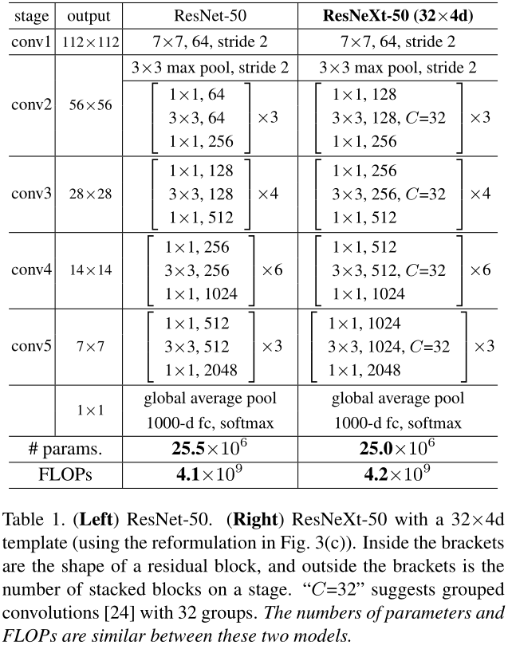  
#### 3.2 Revisiting Simple Neurons
最简单的人工神经元就是执行內积（权值相加），实现元素级转换。內积可以表示成转换的聚合形式：  
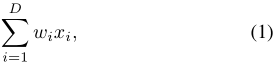  
如图2中所示，內积操作可以分为拆分（splitting）、变换（transforming）、聚合（aggregating）。  
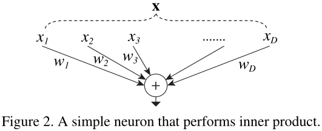  
#### 3.3 Aggregated Transformations
将內积中的基本变换替换成更一般的函数，比如一个网络结构，那么聚合变换变成：  
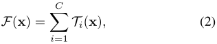  
公式(2)中的C表示变换的规模，称之为基数。C可以是任意值，它的取值控制着更复杂变换的规模。  
本文中所有的变换Ti都具有相同的拓扑结构，如图1-right所示。  
那么公式(2)中的聚合变换就是残差函数：  
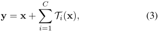  
**Relation to Inception-ResNet**  
ResNeXt中的模块结构（图3(a)）与Inception-ResNet的模块结构（图3(b)）相似，不同的是ResNeXt中的模块都是相同的拓扑结构。  
**Relation to Grouped Convolutions**  
使用分组卷积可以将上述模块的结构进一步简化，如图3(c)所示。所有低维的编码（第一个1x1层）可以由一个更宽的层替代，因为分组卷积
会将输入张量在通道维度上拆分成不同组然后进行处理，然后将处理后的张量连接起来作为输出。这种block与ResNet中原始block的形式（图1-left）很相似，
不同的是这些block更宽，并且是稀疏连接的。  
  
我们注意到只有block的深度大于2时才可以重新组织得到不同以往的拓扑结构，而深度只有2的block（见图4）重新组织也只是宽一些密集一些的模块。 
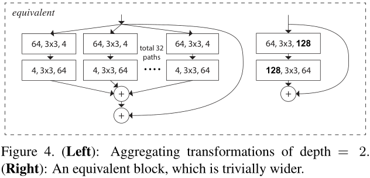  
另外需要注意的是各小分支的变换不一定就是像图3中所示都是相同拓扑结构的，它们也可以是任意不同形式的变换。本文选取同结构的形式是为了使
网络更加简洁已经易扩展，在这种情况下就可以像图3(c)中所示使用分组卷积很容易的实现ResNeXt。  
#### 3.4 Model Capacity
ResNeXt在保持模型复杂度和参数规模不变的情况下提升了模型准确率。复杂度和参数数量可以用来评估模型的表示能力，在考察深度网络时基本都会用到。
当考察相同复杂度下不同的基数C对模型性能的影响时，为了减少需要修改的超参数量，我们选取修改bottleneck（3x3卷积层）的宽度（通道数量）
来适应基数的变化，因为它独立于block的输入/输出，这样就不需要对其他的超参数（如block的深度、输入/输出的宽度等）。  
  
在图1-left中，原来的ResNet的block的参数数量有256\*64+3\*3\*64\*64+64\*256≈70k，当ResNeXt基数为C，bottleneck层宽度为d时（图1-right），
参数数量为：  
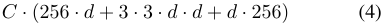  
当C=32，d=4时公式(4)约等于70k，与原来的模型基本相同，表2展示了C与d的关系。  
  
表1比较了具有相似复杂度的ResNet-50和ResNeXt-50，虽然复杂度只是大致相似，但之间的差异很小不至于影响结果。  

### 4. Implementation details
维度增加（空间尺寸减小）时沿用ResNet中的B方案，但是卷积核由1x1变为3x3，步幅仍然为2。本文实现的方案选取了如图3(c)中的形式，
block内部的设计（权值层与BN、ReLU的位置安排）按照ResNet方式，而不是ResNet-v2方式。图3中三种方案是等价的，
我们训练了三种形式都得到了相同的结果，选取3(c)来实现是因为这个方案更简洁，运行速度也更快。  

### 5. Experiments
#### 5.1 Experiments on ImageNet-1K
**Cardinality vs. Width**   
首先考察基数对模型性能的影响。结果见表3，训练曲线见图5。  
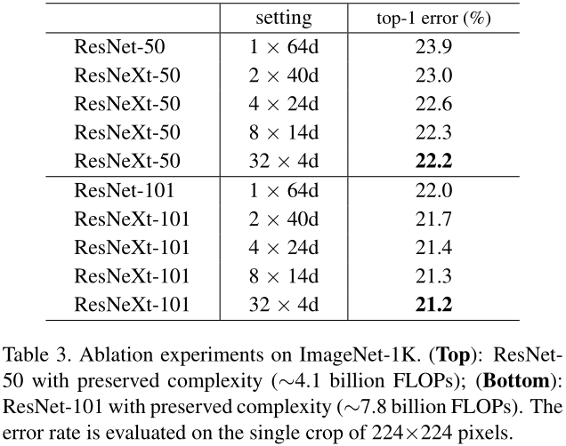  
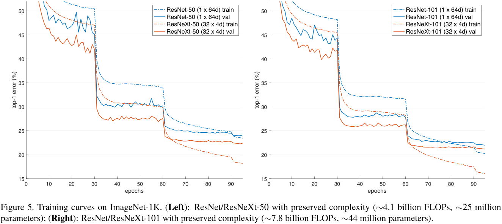  
复杂度不变的情况下，随着基数的增大错误率持续减小。ResNeXt的训练误差比ResNet的要小，说明性能的提升是来源于更强的表示能力而不是正则化。
从表3中可以看出，当bottleneck的宽度很小时，增加基数对模型性能的提升趋于饱和，所以bottleneck宽度的选取一般不小于4d。  
**Increasing Cardinality vs. Deeper/Wider**   
考察增加深度/宽度/基数对网络性能的提升。具体表现见表4。  
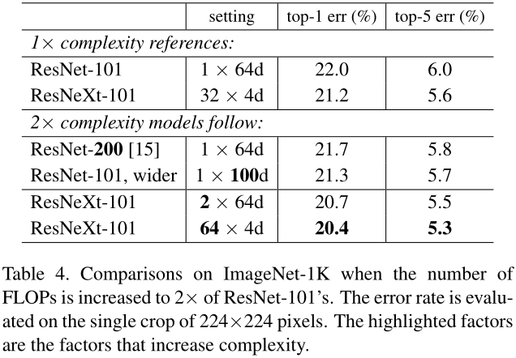  
从表4中可以看出，通过增大基数来提升网络能力比深度、宽度更有效。  
**Performance**  
Torch对分组卷积的实现优化不理想，运行开支比较大。  
**Comparisons with state-of-the-art results**  
表5展示了ResNeXt与各种之前最先进的模型的性能对比。  
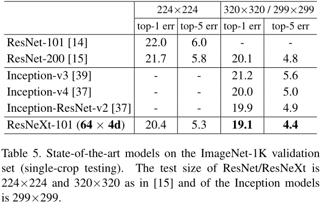  
#### 5.2 Experiments on ImageNet-5K
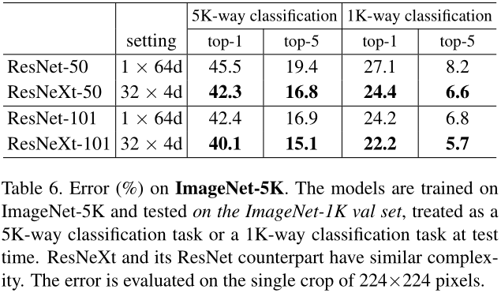  
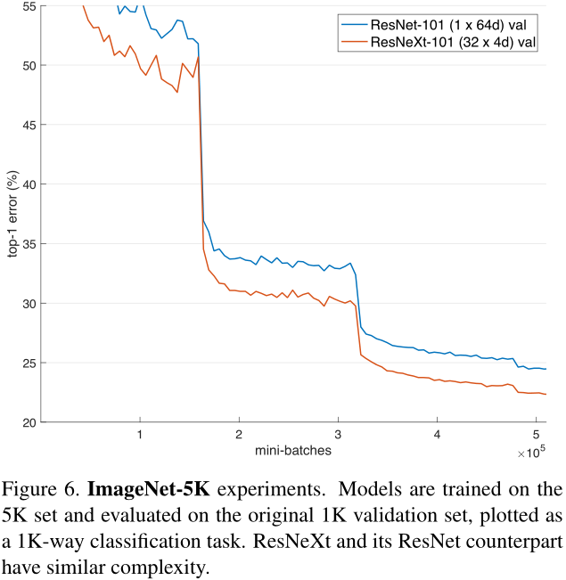  
#### 5.3 Experiments on CIFAR
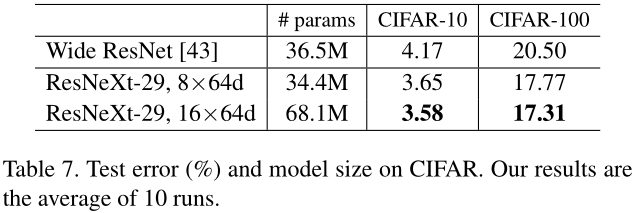  
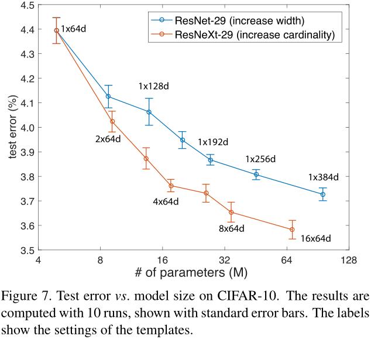  
#### 5.4 Experiments on COCO object detection
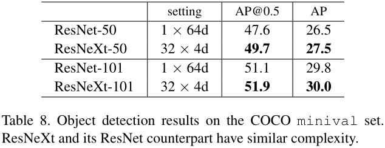  
