# ResNet-v2
[Identity Mappings in Deep Residual Networks](https://arxiv.org/abs/1603.05027)  
Kaiming He, Xiangyu Zhang, Shaoqing Ren, Jian Sun  

### 摘要
近期已经涌现出很多以深度残差网络（deep residual network）为基础的极深层的网络架构，在准确率和收敛性等方面的表现都非常引人注目。
本文主要分析残差网络基本构件（block）中的信号传播，我们发现当使用恒等映射（identity mapping）作为快捷连接（skip connection）
并且将激活函数移至加法操作后面时，前向-反向信号都可以在两个block之间直接传播而不受到任何变换操作的影响。大量实验结果证明了恒等映射的重要性。
本文根据这个发现重新设计了一种残差网络基本单元（unit），使得网络更易于训练并且泛化性能也得到提升。官方实现（Torch）的源码地址：
https://github.com/KaimingHe/resnet-1k-layers 。  

### 1. Introduction
深度残差网络（ResNet）由“残差单元（Residual Units）”堆叠而成，每个单元可以表示为：  
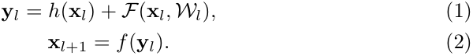  
其中F是残差函数，在ResNet中，h(xl)=xl是恒等映射，f是ReLU激活函数。  
在ImageNet数据集和COCO数据集上，超过1000层的残差网络都取得了最优的准确率。残差网络的**核心思想**是在h(xl)的基础上学习附加的残差函数F，
其中很重要的选择就是使用恒等映射h(xl)=xl，这可以通过在网络中添加恒等快捷连接（skip connection / shortcut）来实现。  
本文中主要着眼于分析在深度残差网络中构建一个信息“直接”传播的路径——不只是在残差单元直接，而是在整个网络中信息可以“直接”传播。
如果h(xl)和f(yl)都是恒等映射，那么信号可以在单元间**直接**进行前向-反向传播。实验证明基本满足上述条件的网络架构一般更容易训练。
本文实验了不同形式的h(xl)，发现使用恒等映射的网络性能最好，误差减小最快且训练损失最低。这些实验说明“干净”的信息通道有助于优化。
各种不同形式的h(xl)见图1,2,4中的灰色箭头所示。  
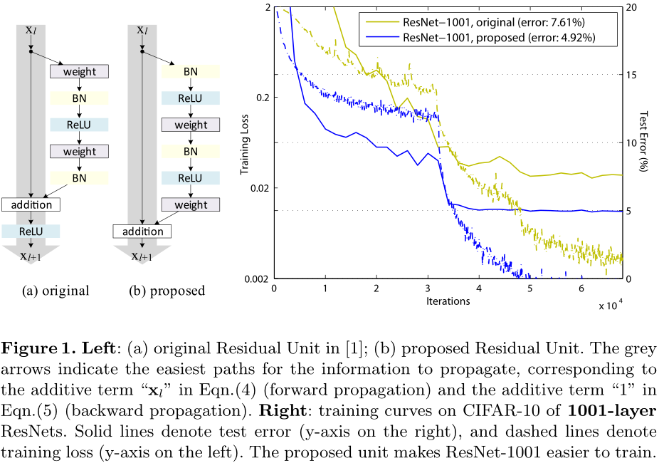  
为了构建f(yl)=yl成为恒等映射，我们将激活函数（ReLU和BN）移到权值层之前，形成一种**“预激活（pre-activation）”**的方式，而不是常规的
“后激活（post-activation）”方式，这样就设计出了一种新的残差单元（见图1(b)）。基于这种新的单元我们在CIFAR-10/100数据集上使用1001层
残差网络进行训练，发现新的残差网络比之前的更容易训练并且泛化性能更好。另外还考察了200层新残差网络在ImageNet上的表现，
原先的残差网络在这个层数之后开始出现过拟合的现象。  

### 2. Analysis of Deep Residual Networks
原先的残差网络中的残差单元可以表示为：  
  
如果h、f都是恒等映射，那么公式(1)(2)可以合并为：  
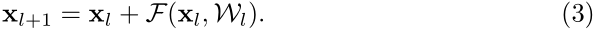  
那么任意深层的单元L与浅层单元l之间的关系为：  
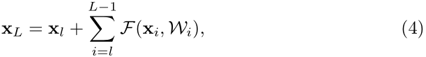  
公式(4)有两个特性：(i)深层单元的特征可以由浅层单元的特征和残差函数相加得到；(ii)任意深层单元的特征都可以由起始特征x0与先前所有残差函数相加得到，
这与普通（plain）网络不同，普通网络的深层特征是由一系列的矩阵向量相乘得到。**残差网络是连加，普通网络是连乘**。  
反向传播时的计算公式如下：  
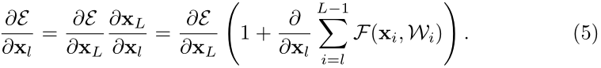  
从公式(5)中可以看出，反向传播也是两条路径，其中之一直接将信息回传，另一条会经过所有的带权重层。另外可以注意到第二项的值在一个
mini-batch中不可能一直是1，也就是说回传的梯度不会消失，不论网络中的权值的值再小都不会发生梯度消失现象。  

### 3. On the Importance of Identity Skip Connections
首先考察恒等映射的重要性。假设将恒等映射简单的改为h(xl)=λxl，即：  
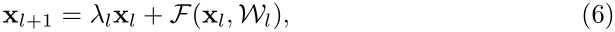  
如公式(3)到(4)一样递归调用公式(6)，得到：  
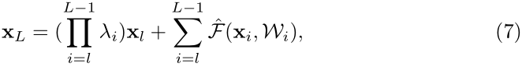  
那么这种情况下的反向传播计算公式为：  
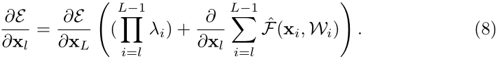  
假设模型是一个极深层的网络，考察第一个连乘的项，如果所有的λ都大于1，那么这一项会指数级增大；如果所有λ都小于1，那么这一项会很小甚至消失，
会阻碍信号直接传播，而强制信号通过带权值的层进行传播。实验表明这种方式会导致模型很难优化。  
不同形式的变换映射都会妨碍信号的传播，进而影响训练进程。  
#### 3.1 Experiments on Skip Connections
考察使用不同形式映射（见图2）的网络的性能，具体结果见表1，在训练过程中的误差变化见图3。  
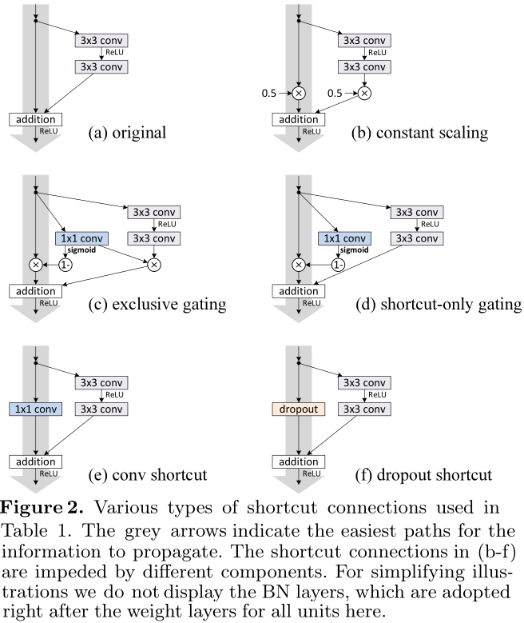  
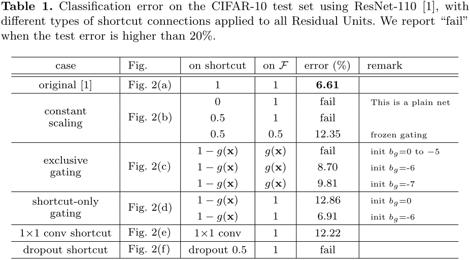  
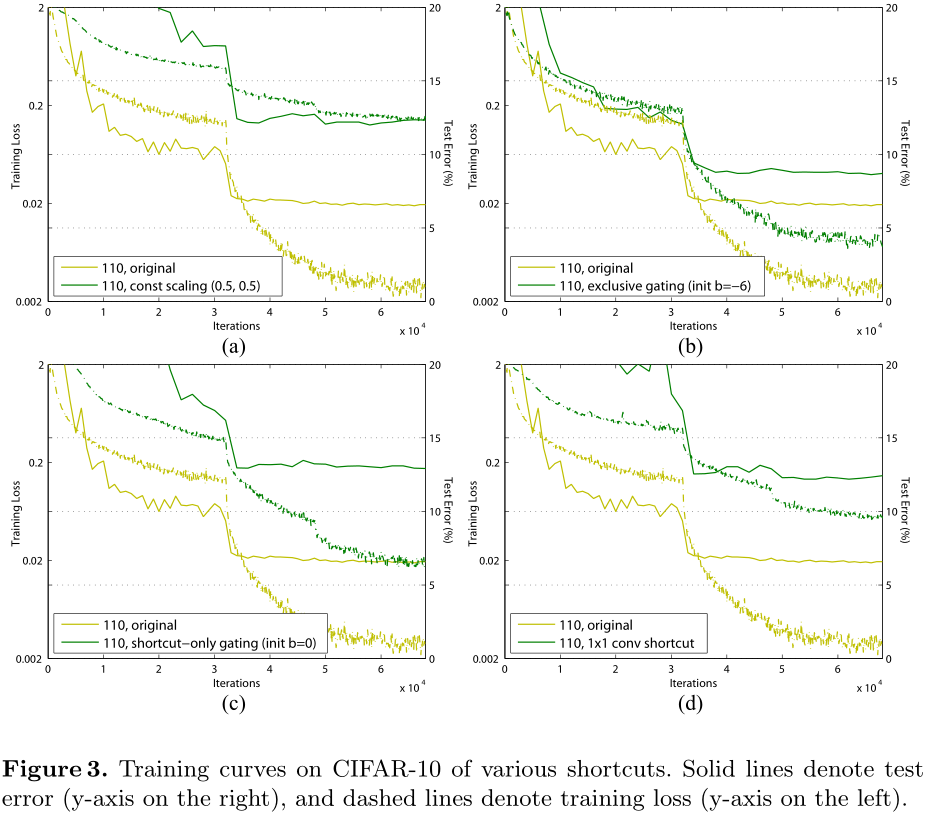  
在使用exclusive gating时，偏置bg的初始值对于网络性能的影响很大。  
#### 3.2 Discussions
快捷连接中的乘法操作（scaling, gating, 1×1 convolutions, and dropout）会妨碍信号传播，导致优化出现问题。  
值得注意的是gating和1×1 convolutions快捷连接引进了更多的参数，增强了模型的表示能力，但是它们的训练误差反而比恒等映射更大，
这说明是退化现象导致了这些模型的优化问题。  

### 4. On the Usage of Activation Functions
第3章讨论了公式(1)中的h是恒等映射的重要性，现在讨论公式(2)中的f，如果f也是恒等映射的话网络性能会不会也有提升。为了使得f是恒等映射，
需要调整ReLU、BN和带权值层的位置。
#### 4.1 Experiments on Activation
下面考察多种组织方式（见图4），使用不同激活方式的网络的性能表现见表2。  
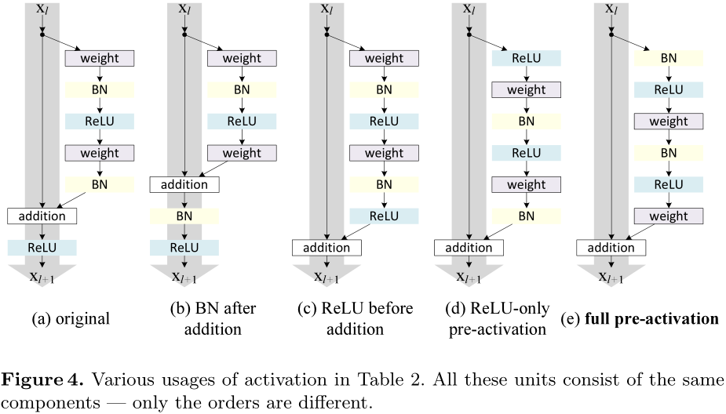  
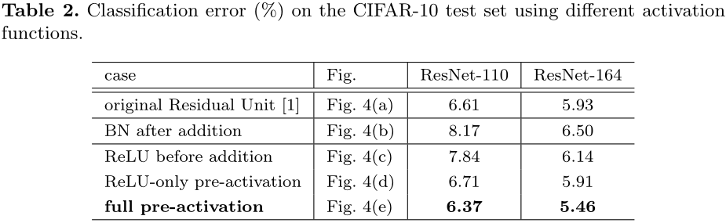  
**BN after addition**  
效果比基准差，BN层移到相加操作后面会阻碍信号传播，一个明显的现象就是训练初期误差下降缓慢。 
**ReLU before addition**  
这样组合的话残差函数分支的输出就一直保持非负，这会影响到模型的表示能力，而实验结果也表明这种组合比基准差。  
**Post-activation or pre-activation?**  
原来的设计中相加操作后面还有一个ReLU激活函数，这个激活函数会影响到残差单元的两个分支，现在将它移到残差函数分支上，快捷连接分支不再受到影响。
具体操作如图5所示。  
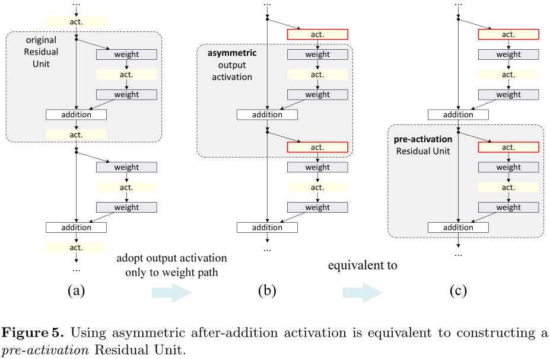  
根据激活函数与相加操作的位置关系，我们称之前的组合方式为“后激活（post-activation）”，现在新的组合方式称之为“预激活（pre-activation）”。
原来的设计与预激活残差单元之间的性能对比见表3。预激活方式又可以分为两种：只将ReLU放在前面，或者将ReLU和BN都放到前面，
根据表2中的结果可以看出full pre-activation的效果要更好。
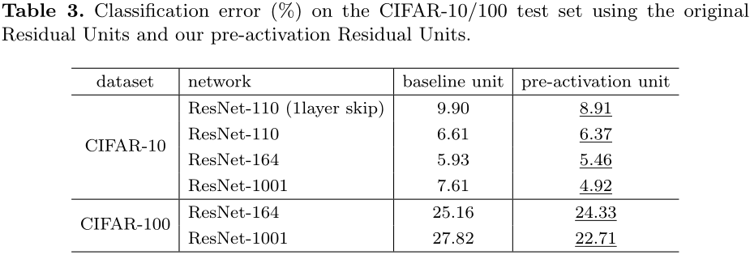  
#### 4.2 Analysis
使用预激活有两个方面的优点：1)f变为恒等映射，使得网络更易于优化；2)使用BN作为预激活可以加强对模型的正则化。  
**Ease of optimization**  
这在训练1001层残差网络时尤为明显，具体见图1。使用原来设计的网络在起始阶段误差下降很慢，因为f是ReLU激活函数，当信号为负时会被截断，
使模型无法很好地逼近期望函数；而使用预激活的网络中的f是恒等映射，信号可以在不同单元直接直接传播。我们使用的1001层网络优化速度很快，
并且得到了最低的误差。  
  
f为ReLU对浅层残差网络的影响并不大，如图6-right所示。我们认为是当网络经过一段时间的训练之后权值经过适当的调整，使得单元输出基本都是非负，
此时f不再对信号进行截断。但是截断现象在超过1000层的网络中经常发生。  
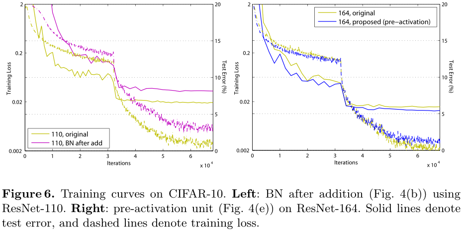  
**Reducing overfitting**  
观察图6-right，使用了预激活的网络的训练误差稍高，但却得到更低的测试误差，我们推测这是BN层的正则化效果所致。原来的设计中虽然也用到了BN，
但归一化后的信号很快与快捷连接通道中的相加了，而相加后的信号是没有归一化的。本文新设计的预激活的单元中的所有权值层的输入都是归一化的信号。  

### 5. Results
表4、表5分别展示了不同网络在不同数据集上的表现。使用的预激活单元的更深层的残差网络都取得了最好的成绩。  
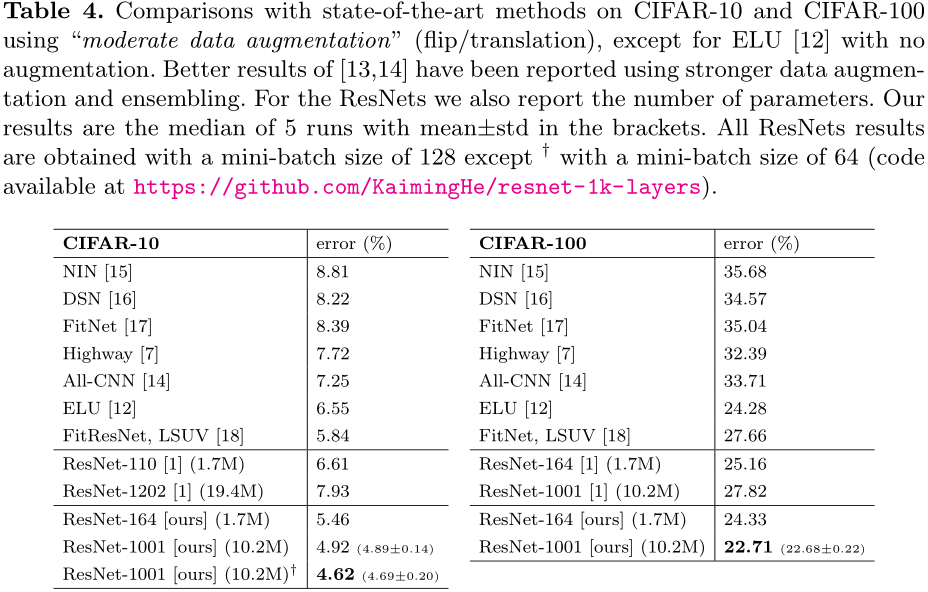  
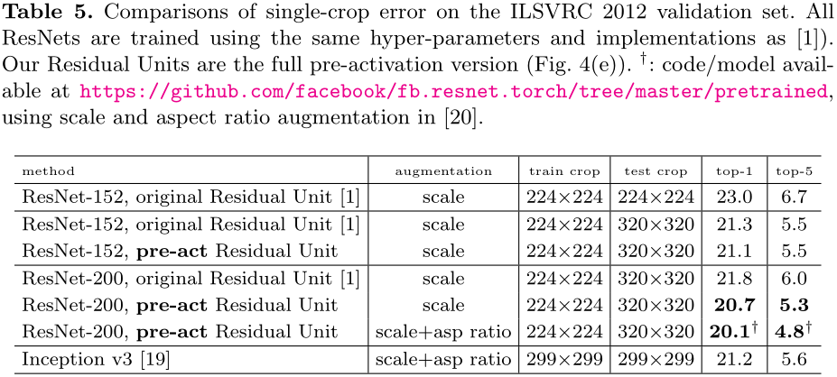  
**Computational Cost** 本文提出的模型的计算复杂度正比于网络深度，在ImageNet数据集上，200层的残差网络使用8块GPU耗时约3周完成训练。  
### 6. Conclusions
恒等映射形式的快捷连接和预激活对于信号在网络中的顺畅传播至关重要。  

另附件介绍了各种网络的实现细节。 
