# ResNet
[Deep Residual Learning for Image Recognition](https://arxiv.org/abs/1512.03385)  
Kaiming He, Xiangyu Zhang, Shaoqing Ren, Jian Sun   

### 摘要
越深层的网络往往越难以训练。本文提出一种残差学习框架，使得比先前网络深的多的网络也易于训练。我们将网络中的层改写为
在参照该层输入的情况下学习残差函数的形式，替换之前那种无参考学习的方式。我们通过大量实验证明这种残差网络易于优化，
并且预测准确率随着网络深度的增加而增大。在ImageNet数据集上使用了一个152层的残差网络，深度是VGG网络的8倍但复杂度却更低。
使用这种残差网络的集合在ImageNet测试集上达到3.57%的top-5错误率，这个结果赢得了ILSVRC2015年分类任务的第一名。
另外我们在CIFAR-10数据集上对100层和1000层的残差网络进行了分析。 
模型表示的深度在许多视觉识别任务中是最重要的影响因素。完全得益于极深层的表示，我们在COCO物体检测数据集上得到了28%的性能提升。
深度残差网络是我们在参加ILSVRC2015和COCO2015竞赛时提交的解决方案的基础，在这两个竞赛中我们还赢得了ImageNet检测、ImageNet定位、
COCO检测以及COCO分割等任务的第一名。 

### 1. Introduction
深度网络可以将低/中/高层特征与分类器结合起来成为一种端到端的多层形式，其中特征的“层”可以通过增加网络层数（深度）来丰富。
最近的研究也表明网络深度对于网络的性能提升至关重要。 
那么，**是不是随着网络中堆叠的层数增加可以很容易的训练得到一个性能更好的网络呢？** 一个恶名昭彰的拦路虎妨碍验证该疑问是否正确——
梯度消失/爆炸，它会妨碍网络收敛。随着归一化初始化、中间归一化层（BN）等技术的提出，梯度消失/爆炸问题得到一定程度的解决，
现在可以使用随机梯度下降（SGD）加上反向传播的方法训练一个数十层的网络至收敛。 
然而，另一个拦路虎来袭——退化（degradation）问题。随着网络深度的增加，准确率趋向于饱和，然后迅速下降。让人出乎意料的是，
这种退化现象**并不是由过拟合导致**，在一个表现不错的网络中添加更多的层反而会导致**更高的训练误差**（过拟合时训练误差减小，
但测试误差增大）。图1中显示了一个典型案例。  
  
训练准确率的退化表明并不是所有系统都易于优化。考虑一个浅层架构以及与其对应的更深层的模型，构造更深层模型的方案是新添加的层
都是简单的恒等映射，其他的层都是从已学习的浅层网络中拷贝得到，那么这样的构造方式表明更深层的网络**不应该**比与之对应的浅层
网络有更高的训练误差。但实验显示我们现阶段的求解器无法发现一个比上述构造方案更好或相当的方案。  
为了解决退化问题，本文提出一种**深度残差学习**框架。我们让每一层学习一个残差映射，并不是像之前一样希望每一层都学习得到所需的潜在映射（
desired underlying mapping）。这里将所需的潜在映射表示为H(x)，那么残差映射可以表示为F(x)=H(x)-x，之前的映射H(x)=F(x)+x。
我们假设残差映射比原来的无参考的映射更容易优化。考虑到一个极端情况，如果最优的方案就是恒等映射，那么将一个残差逼近零比使用
一组堆叠的非线性层来拟合恒等映射要容易的多。  
公式F(x)+x可以通过在前馈神经网络中添加“快捷连接（shortcut connections）”来实现，快捷连接就是在网络中跳过若干层而直接相连（见图2）。
在本文中，快捷连接是为了实现恒等映射，它的输出与一组堆叠层的输出相加（见图2）。恒等快捷连接没有增加额外的参数及计算复杂度，
修改后的网络仍然可以使用SGD及BP进行端到端的训练，并且利用现有的深度学习软件框架（如Caffe）可以很容易构建出来。  
  
实验表明：1)极深的残差网络依然易于优化，但是相应的“普通（plain）”网络（只是简单地堆叠层）随着深度增加训练误差也越来越大；
2)深度残差网络随着深度的极大增加准确率也会提高，得到比先前网络更好的结果。 

### 2. Related Work
**残差表示（Residual Representations）**  
在做矢量量化编码（vector quantization）时，对残差矢量进行编码相较于对原始矢量进行编码要更高效。 
用于求解偏微分方程（Partial Differential Equations, PDEs）的多重网格（Multigrid）法的思想表明，恰当的重定义或预处理可以简化优化过程。 
**快捷连接（Shortcut Connections）**  
快捷连接在很多网络结构中得到应用，或为了解决梯度消失/爆炸问题，或为了增强网络表示能力。 
与本文思想一致的是Highway Networks，其中提出的快捷连接由门限函数控制。门限函数包含参数且依赖于数据，因此Highway 
Networks中的门限会有“关闭”的情况，此时网络的表现如同无残差函数即普通的网络结构。而本文方法使用的恒等连接没有参数，永远不会关闭，
所有信息始终畅通无阻的进行传播，网络只是学习残差函数。另外，没有实验证明Highway Networks可以随着网络深度的极大增加相应的提高准确率。  

### 3. Deep Residual Learning
#### 3.1. Residual Learning
用H(x)表示若干堆叠层所拟合的潜在映射，x表示这些层中第一层的输入。如果多个非线性层可以渐进拟合任意复杂函数的假设成立，
那么它们可以渐进拟合残差函数（如H(x)-x）的假设也成立。所以与其期望堆叠层拟合H(x)，我们直接让这些层拟合残差函数F(x)=H(x)-x，
虽然这两种形式都可以拟合真正所需的函数，但训练学习的难易程度是不同的。  
这样重定义的动机就是退化问题，如果新添加的层只是恒等映射，那么更深层的网络不应该比相应的浅层网络具有更高的训练误差，
但是退化问题表明当前的求解器难以将多层非线性层近似成恒等映射。而使用残差学习的重定义形式，如果恒等映射是最优解，
那么求解器可以很容易的将非线性层的参数全都逼近零来近似恒等映射。 
在实际情况下恒等映射不见得就是最优解，但是这样的重定义可能给问题提供了一个合理的先决条件。如果最优函数近似于恒等映射而不是乘零映射，
那么求解器在参考恒等映射的前提下可以很容易的发现这些小的扰动，比重新学习一个新的函数要简单的多。实验表明（见图7），
学习得到的残差函数通常都是很小的响应值，表明将恒等映射作为先决条件是合理的。 
  
#### 3.2. Identity Mapping by Shortcuts
本文将残差学习应用于若干堆叠层的组合，基本的构造单元（building block）如图2所示，将构造单元定义为： 
y = F(x,{Wi}) + x --- (1)  
F(x,{Wi})表示学习得到的残差映射。F+x由快捷连接和元素级加法实现，而快捷连接不会增加参数量及计算复杂度。 x与F的维度必须相同，
在改变输入输出的通道数时也要相应改变x的维度。残差函数F可以是任意形式，本文使用两个或三个网络层来表示F（见图5），当然也可以使用更多的层，
但是单个层的效果相当于线性层y=W1x+x，没有发现什么优势。  
#### 3.3. Network Architectures
**Plain Networks**  
主要借鉴于VGG网络，卷积核最大3x3并遵循下面两个设计原则：(i)如果输出特征图的尺寸相同，那么特征图的数量也相同；
(ii)如果特征图尺寸减半，那么卷积核数量加倍，保证每层的计算复杂度相同。降采样由步长为2的卷积层实现，网络最后是全局平均池化层和
1000路全连接层及softmax层。带权重的层总共有34个（见图3-middle）。注意，这个模型比VGG网络的复杂度要低，共36亿FLOPs，只有VGG-19的18%。  
**Residual Network**  
在上面Plain Networks的基础上插入快捷连接就成为深度残差网络（见图3-right）。当block的维度发生变化时有两个解决办法：
(A)捷径仍然是恒等映射，在新增的维度填充零，这个方法不会增加额外的参数；(B)使用变换映射来匹配新的维度（一般是用1x1卷积层实现）。  
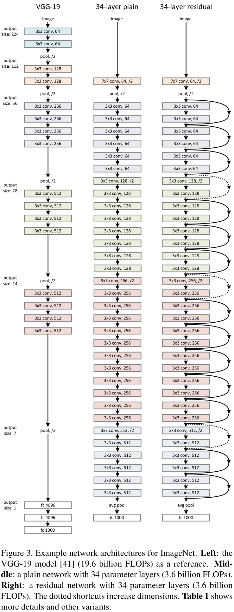  
#### 3.4. Implementation
在ImageNet数据集上训练，图像在[256,480]范围内随机缩放，在缩放后的图像中随机剪切224x224的区域并水平翻转，然后做像素级的均值减除，
另外也使用颜色增广方法。在每个卷积层激活函数之前应用batch normalization，使用msra初始化方法。使用SGD，batch size为256，初始学习率为0.1，
当训练误差停止下降时除10。权值衰减系数0.0001，动量0.9，没有使用dropout。  
测试时使用10个剪切块，并在不同分辨率上{224,256,384,480,640}分别预测，最后取平均值作为最终的结果。  

### 4. Experiments
#### 4.1. ImageNet Classification
使用不同网络进行实验，具体配置如表1，结果见表2。
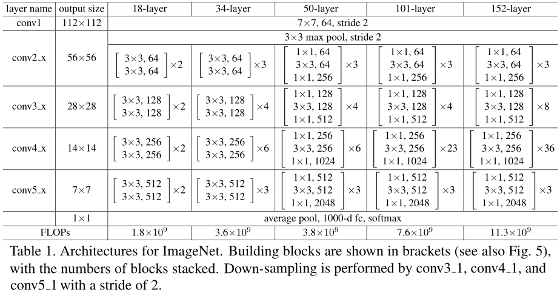  
 
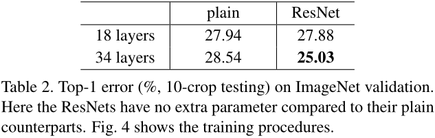  
**Plain Networks**  
从表2中可以看出，更深层的普通网络比浅层网络有更高的验证误差。通过比较它们在训练过程中的训练/验证误差（见图4），
以发现退化问题——34层的普通网络在整个训练过程中都有更高的训练误差，虽然18层网络的解空间是34层网络解空间的子空间。 
这种优化问题不太可能由梯度消失导致，BN的使用保证了信号在前向/反向传播时都不会消失。我们推测深层的普通网络可能是指数级低的收敛速率，
因此影响到了训练误差的减小（然而实验延长训练时间并没有发现该问题改进的迹象）。 
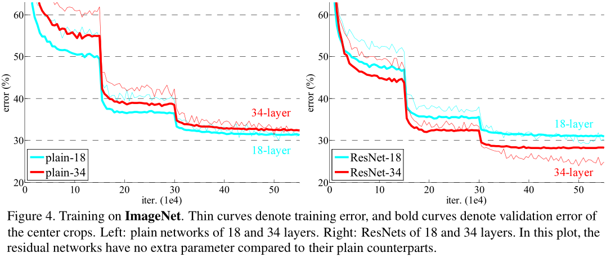  
**Residual Networks**  
残差网络的结果却恰恰相反。34层的残差网络表现要比18层的更好，这表明残差网络可以解决退化问题，
并且可以随着深度的增加而提高准确率。34层残差网络的表现比34层普通网络要好，这证明了残差学习在深度模型中的有效性。
另外18层的残差网络和18层的普通网络性能相当，但是收敛速度更快（见图4），这说明在网络“并不太深”时，当前的求解器可以很好的解决，
在这种情况下残差网络通过在早期加速收敛速度使得优化更容易。  
**Identity vs. Projection Shortcuts**  
3.3中介绍在维度发生变化时的处理方法(A)(B),再加一种(C)所有快捷连接都经过变换，表3展示了不同方法的性能。
从表3中可以看出三种方法都比相应的普通网络的表现要好，B比A要好一些，主要因为A的零值填充并没有残差学习，C比B稍好，但会引入更多的参数，
综合来看ABC的差别并不大，这说明变换快捷连接对解决退化问题不是必需的，为了减少内存/时间复杂度以及模型大小，本文采用B方案。  
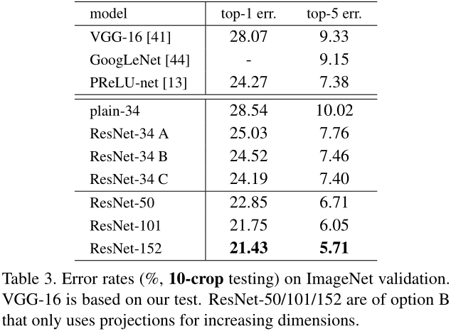  
**Deeper Bottleneck Architectures**  
将基本构造单元修改为bottleneck形式，具体见图5。第一个1x1卷积层为了降维，第二个1x1层为了恢复原来的维度，
这样使得中间的3x3卷积层有更小的输入/输出维度。这两种设计具有相似的时间复杂度。  
无参数的恒等映射在bottleneck架构中特别重要，如果将恒等映射改为变换映射，那么时间复杂度和模型大小都将翻倍，因为快捷连接的两端都有很高维度。  
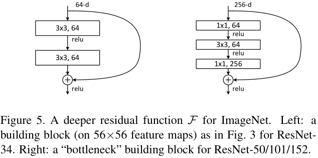  
**50-layer ResNet**  
用三层的bottleneck替换原来的两层形式，网络中带参数的层共有50个，具体如表1，维度增加时使用B方案，该模型共有38亿FLOPs。  
**101-layer and 152-layer ResNets**  
更深层的网络，具体配置见表1。虽然深度急剧增加，但152层ResNet（113亿FLOPs）仍然比VGG-16/19（153/196亿FLOPs）的复杂度更低。  
从表3，表4中可以看出50/101/152层ResNet比34层的准确率更高。并没有发现退化现象，并且随着深度增加准确率也相应提升。  
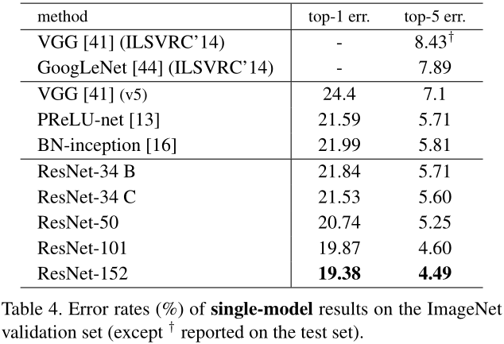  
**Comparisons with State-of-the-art Methods**  
从表4中可以看出，ResNet比先前的网络性能更好。单个152层ResNet的top-5错误率4.49%低于所有网络，而结合了6个网络（其中2个152层）可以达到
3.57%的top-5错误率，以此赢得ILSVRC2015年的第一名（见表5）。  
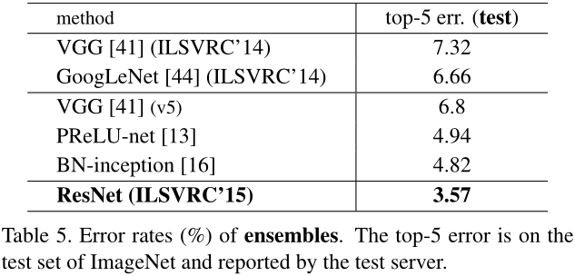  

#### 4.2. CIFAR-10 and Analysis
使用CIFAR-10测试了不同的网络，考察其性能，具体表现如表6所示。  
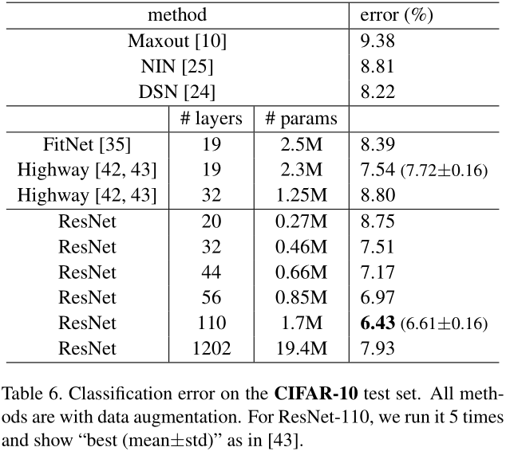  
各网络在训练过程中的训练/测试误差如图6所示，总体而言符合预期。普通网络随着深度的增加误差反而增大，出现退化现象；
而残差网络随着深度增加误差也相应减小，说明残差网络很好的解决了退化问题，但有一点需要注意，就是极深层的情况——1202层网络。  
**Exploring Over 1000 layers**  
1202层的残差网络虽然也收敛并且误差也比较小，但是它的性能却比110层的网络要差。我们认为导致该现象的原因是过拟合，
CIFAR-10数据集比较小，不需要用1202层这么复杂的网络，另外在这个实验中我们也没有使用maxout或dropout等比较强的正则化方法，
一般来说使用这些正则化方法在小规模数据集上会取得更好的结果，所以如果本文的网络添加了这些正则化的方法应该能获得更好的结果。  
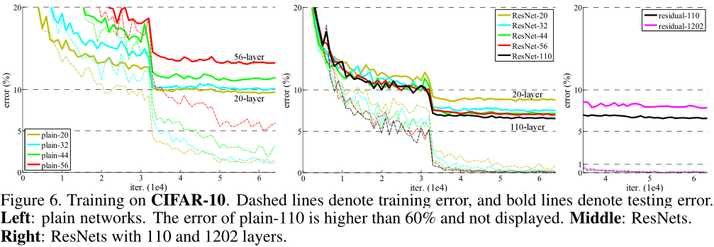  
**Analysis of Layer Responses**  
3.1节就提到了网络层的响应值的问题，现在分别对不同网络的响应值进行考察，从图7中可以看出，残差网络中的层的响应值通常要比普通网络中的小，
这个结果说明残差函数比非残差函数更接近于零。另外越深层的网络中的层的响应值越小，具有越多层的残差网络在每一层中对信号的修改就越少。  
  

#### 4.3 Object Detection on PASCAL and MS COCO
本文提出的残差网络在其他的视觉任务中也有很好的泛化性能。表7、表8分别展示了不同网络在PASCAL VOC和COCO数据集上进行物体检测的表现。
检测算法使用Faster R-CNN架构，具体的细节见附件。  
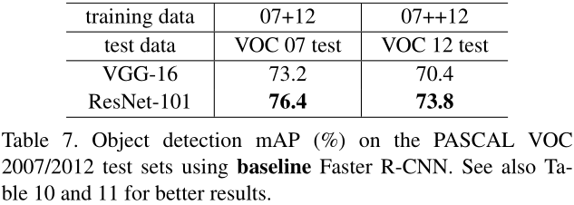  
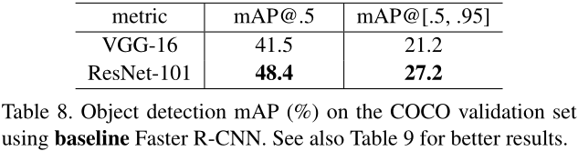  

### 疑惑
对于该架构有个疑问，在3.3中介绍当维度增加时有两种方法可以保证维度一致，文章中推荐B方案，就是使用卷积核1x1步长2的卷积层来处理。
但是这样做的话原来恒等映射的信息会丢失75%，那么使用核2x2步长2的max/average-pooling或者卷积层会不会更好一些？  
[#50 when the dimensions increase](https://github.com/KaimingHe/deep-residual-networks/issues/50)  
