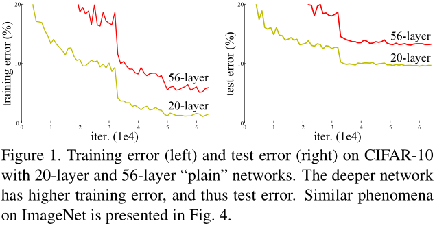
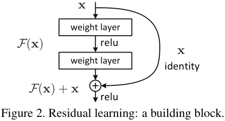
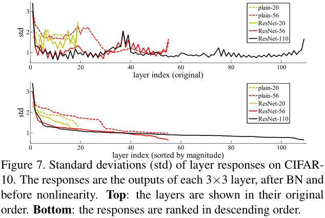

# ResNet
[Deep Residual Learning for Image Recognition](https://arxiv.org/abs/1512.03385)  

### 摘要
越深层的网络往往越难以训练。本文提出一种残差学习框架，使得比先前网络深的多的网络也易于训练。我们将网络中的层改写为
在参照该层输入的情况下学习残差函数的形式，替换之前那种无参考学习的方式。我们通过大量实验证明这种残差网络易于优化，
并且预测准确率随着网络深度的增加而增大。在ImageNet数据集上使用了一个152层的残差网络，深度是VGG网络的8倍但复杂度却更低。
使用这种残差网络的集合在ImageNet测试集上达到3.57%的top-5错误率，这个结果赢得了ILSVRC2015年分类任务的第一名。
另外我们在CIFAR-10数据集上对100层和1000层的残差网络进行了分析。 
模型表示的深度在许多视觉识别任务中是最重要的影响因素。完全得益于极深层的表示，我们在COCO物体检测数据集上得到了28%的性能提升。
深度残差网络是我们在参加ILSVRC2015和COCO2015竞赛时提交的解决方案的基础，在这两个竞赛中我们还赢得了ImageNet检测、ImageNet定位、
COCO检测以及COCO分割等任务的第一名。 

### 1. Introduction
深度网络可以将低/中/高层特征与分类器结合起来成为一种端到端的多层形式，其中特征的“层”可以通过增加网络层数（深度）来丰富。
最近的研究也表明网络深度对于网络的性能提升至关重要。 
那么，**是不是随着网络中堆叠的层数增加可以很容易的训练得到一个性能更好的网络呢？** 一个恶名昭彰的拦路虎妨碍验证该疑问是否正确——
梯度消失/爆炸，它会妨碍网络收敛。随着归一化初始化、中间归一化层（BN）等技术的提出，梯度消失/爆炸问题得到一定程度的解决，
现在可以使用随机梯度下降（SGD）加上反向传播的方法训练一个数十层的网络至收敛。 
然而，另一个拦路虎来袭——退化（degradation）问题。随着网络深度的增加，准确率趋向于饱和，然后迅速下降。让人出乎意料的是，
这种退化现象**并不是由过拟合导致**，在一个表现不错的网络中添加更多的层反而会导致**更高的训练误差**（过拟合时训练误差减小，
但测试误差增大）。图1中显示了一个典型案例。  
  
训练准确率的退化表明并不是所有系统都易于优化。考虑一个浅层架构以及与其对应的更深层的模型，构造更深层模型的方案是新添加的层
都是简单的恒等映射，其他的层都是从已学习的浅层网络中拷贝得到，那么这样的构造方式表明更深层的网络**不应该**比与之对应的浅层
网络有更高的训练误差。但实验显示我们现阶段的求解器无法发现一个比上述构造方案更好或相当的方案。  
为了解决退化问题，本文提出一种**深度残差学习**框架。我们让每一层学习一个残差映射，并不是像之前一样希望每一层都学习得到所需的潜在映射（
desired underlying mapping）。这里将所需的潜在映射表示为H(x)，那么残差映射可以表示为F(x)=H(x)-x，之前的映射H(x)=F(x)+x。
我们假设残差映射比原来的无参考的映射更容易优化。考虑到一个极端情况，如果最优的方案就是恒等映射，那么将一个残差逼近零比使用
一组堆叠的非线性层来拟合恒等映射要容易的多。  
公式F(x)+x可以通过在前馈神经网络中添加“快捷连接（shortcut connections）”来实现，快捷连接就是在网络中跳过若干层而直接相连（见图2）。
在本文中，快捷连接是为了实现恒等映射，它的输出与一组堆叠层的输出相加（见图2）。恒等快捷连接没有增加额外的参数及计算复杂度，
修改后的网络仍然可以使用SGD及BP进行端到端的训练，并且利用现有的深度学习软件框架（如Caffe）可以很容易构建出来。  
  
实验表明：1)极深的残差网络依然易于优化，但是相应的“普通（plain）”网络（只是简单地堆叠层）随着深度增加训练误差也越来越大；
2)深度残差网络随着深度的极大增加准确率也会提高，得到比先前网络更好的结果。 

### 2. Related Work
**残差表示（Residual Representations）**  
在做矢量量化编码（vector quantization）时，对残差矢量进行编码相较于对原始矢量进行编码要更高效。 
用于求解偏微分方程（Partial Differential Equations, PDEs）的多重网格（Multigrid）法的思想表明，恰当的重定义或预处理可以简化优化过程。
**快捷连接（Shortcut Connections）**  
快捷连接在很多网络结构中得到应用，或为了解决梯度消失/爆炸问题，或为了增强网络表示能力。 
与本文思想一致的是Highway Networks，其中提出的快捷连接由门限函数控制。门限函数包含参数且依赖于数据，因此Highway 
Networks中的门限会有“关闭”的情况，此时网络的表现如同无残差函数即普通的网络结构。而本文方法使用的恒等连接没有参数，永远不会关闭，
所有信息始终畅通无阻的进行传播，网络只是学习残差函数。另外，也没有实验证明Highway Networks可以随着网络深度的极大增加相应的提高准确率。  

### 3. Deep Residual Learning
#### 3.1. Residual Learning
用H(x)表示若干堆叠层所拟合的潜在映射，x表示这些层中第一层的输入。如果多个非线性层可以渐进拟合任意复杂函数的假设成立，
那么它们可以渐进拟合残差函数（如H(x)-x）的假设也成立。所以与其期望堆叠层拟合H(x)，我们直接让这些层拟合残差函数F(x)=H(x)-x，
虽然这两种形式都可以拟合真正所需的函数，但训练学习的难易程度是不同的。  
这样重定义的动机就是退化问题，如果新添加的层只是恒等映射，那么更深层的网络不应该比相应的浅层网络具有更高的训练误差，
但是退化问题表明当前的求解器难以将多层非线性层近似成恒等映射。而使用残差学习的重定义形式，如果恒等映射是最优解，
那么求解器可以很容易的将非线性层的参数全都逼近零来近似恒等映射。 
在实际情况下恒等映射不见得就是最优解，但是这样的重定义可能给问题提供了一个合理的先决条件。如果最优函数近似于恒等映射而不是乘零映射，
那么求解器在参考恒等映射的前提下可以很容易的发现这些小的扰动，比重新学习一个新的函数要简单的多。实验表明（见图7），
学习得到的残差函数通常都是很小的响应值，表明将恒等映射作为先决条件是合理的。 
  

