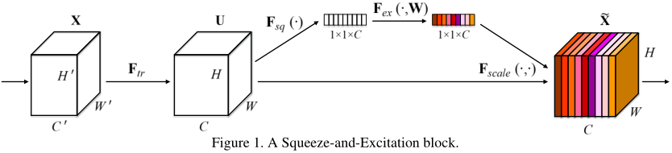

# SENet
[Squeeze-and-Excitation Networks](https://arxiv.org/abs/1709.01507)  
Jie Hu, Li Shen, Gang Sun  

### 摘要
卷积神经网络顾名思义就是依赖卷积操作，使用局部感受区域（local receptive field）的思想融合空间信息和通道信息来提取包含信息的特征。
有很多工作从增强空间维度编码的角度来提升网络的表示能力，本文主要聚焦于通道维度，并提出一种新的结构单元——“Squeeze-and-Excitation(SE)”单元，
对通道间的依赖关系进行建模，可以自适应的调整各通道的特征响应值。如果将SE block添加到之前的先进网络中，只会增加很小的计算消耗，
但却可以极大地提升网络性能。依靠SENet作者获得了ILSVRC2017分类任务的第一名，top-5错误率为2.251%。  

### 1. Introduction
每个卷积层有若干滤波器，可以学习表达包含所有通道的局部空间连接模式。也就是说，卷积滤波器提取局部感受区域中的空间和通道的融合信息。
再加上非线性激活层和降采样层，CNN可以获得具有全局感受区域的分层模式来作为图像的描述。最近的一些工作表明，
可以通过加入有助于获取空间相关性的学习机制来改善网络的性能，而且不需要额外的监督。例如Inception架构，通过在模块中加入多尺度处理来提高性能。
另有探索更好的空间相关性的模型或者添加空间注意力的一些工作。  
与上述方法不同，本文主要探索网络架构设计的另一个方面——通道关联性。本文提出一种新的网络单元——“Squeeze-and-Excitation(SE)” block，
希望通过对各通道的依赖性进行建模以提高网络的表示能力，并且可以对特征进行逐通道调整，这样网络就可以学习通过全局信息来有选择性的加强
包含有用信息的特征并抑制无用特征。  
SE block的基本结构见图1。第一步squeeze操作，将各通道的全局空间特征作为该通道的表示，形成一个通道描述符；第二步excitation操作，
学习对各通道的依赖程度，并根据依赖程度的不同对特征图进行调整，调整后的特征图就是SE block的输出。  
  
前面层中的SE block以类别无关（class agnostic）的方式增强可共享的低层表示的质量。越后面的层SE block越来越类别相关。
SE block重新调整特征的益处可以在整个网络中积累。  
SE block设计简单，可以很容易地加入到已有的网络中，只增加少量的模型复杂度和计算开支，另外对不同数据集的泛化能力较强。  
依靠SENet获取了ILSVRC2017分类任务的第一名。  

### 2. Related Work
**Deep architectures**  

