# SENet
[Squeeze-and-Excitation Networks](https://arxiv.org/abs/1709.01507)  
Jie Hu, Li Shen, Gang Sun  

### 摘要
卷积神经网络顾名思义就是依赖卷积操作，使用局部感受区域（local receptive field）的思想融合空间信息和通道信息来提取包含信息的特征。
有很多工作从增强空间维度编码的角度来提升网络的表示能力，本文主要聚焦于通道维度，并提出一种新的结构单元——“Squeeze-and-Excitation(SE)”单元，
对通道间的依赖关系进行建模，可以自适应的调整各通道的特征响应值。如果将SE block添加到之前的先进网络中，只会增加很小的计算消耗，
但却可以极大地提升网络性能。依靠SENet作者获得了ILSVRC2017分类任务的第一名，top-5错误率为2.251%。  

### 1. Introduction
每个卷积层有若干滤波器，可以学习表达包含所有通道的局部空间连接模式。也就是说，卷积滤波器提取局部感受区域中的空间和通道的融合信息。
再加上非线性激活层和降采样层，CNN可以获得具有全局感受区域的分层模式来作为图像的描述。最近的一些工作表明，
可以通过加入有助于获取空间相关性的学习机制来改善网络的性能，而且不需要额外的监督。例如Inception架构，通过在模块中加入多尺度处理来提高性能。
另有探索更好的空间相关性的模型或者添加空间注意力的一些工作。  
与上述方法不同，本文主要探索网络架构设计的另一个方面——通道关联性。本文提出一种新的网络单元——“Squeeze-and-Excitation(SE)” block，
希望通过对各通道的依赖性进行建模以提高网络的表示能力，并且可以对特征进行逐通道调整，这样网络就可以学习通过全局信息来有选择性的加强
包含有用信息的特征并抑制无用特征。  
SE block的基本结构见图1。第一步squeeze操作，将各通道的全局空间特征作为该通道的表示，形成一个通道描述符；第二步excitation操作，
学习对各通道的依赖程度，并根据依赖程度的不同对特征图进行调整，调整后的特征图就是SE block的输出。  
  
前面层中的SE block以类别无关（class agnostic）的方式增强可共享的低层表示的质量。越后面的层SE block越来越类别相关。
SE block重新调整特征的益处可以在整个网络中积累。  
SE block设计简单，可以很容易地加入到已有的网络中，只增加少量的模型复杂度和计算开支，另外对不同数据集的泛化能力较强。  
依靠SENet取得了ILSVRC2017分类任务的第一名。官方实现（Caffe）源码地址：https://github.com/hujie-frank/SENet 。  

### 2. Related Work
**Deep architectures**  
有很多工作通过调整卷积神经网络架构使模型更容易地学习深层特征以提升模型性能。VGG和Inception网络证明可以通过增加深度来提升性能。
Batch normalization (BN)在网络中添加可以调节输入数据的单元来稳定学习过程，改善梯度在网络中的传播，使得更深层的网络也可以工作。
[ResNet](https://github.com/binLearning/caffe_toolkit/tree/master/ResNet)、
[ResNet-v2](https://github.com/binLearning/caffe_toolkit/tree/master/ResNet-v2)在网络中加入恒等映射形式的跳跃连接，
使网络学习残差函数，极大推进了网络架构向更深层的发展。[DenseNet](https://github.com/binLearning/caffe_toolkit/tree/master/DenseNet)、
[DPN](https://github.com/binLearning/caffe_toolkit/tree/master/DPN)通过调整网络各层间的连接机制来提升深层网络的学习和表示性能。  
另一个方向是调整网络中模块的形式。分组卷积（grouped convolutions）可以用于增加基数（cardinality），如Deep roots、
[ResNeXt](https://github.com/binLearning/caffe_toolkit/tree/master/ResNeXt)中所示，网络可以学习到更丰富的表示。
多分支卷积（multi-branch convolutions）可以视为分组卷积的泛化，网络模块可以进行更灵活多变的操作，如Inception系列。
跨通道相关是一种新的特征组合方式，可以独立于空间结构（如Xception），或者使用1x1卷积进行处理（如NIN），
一般来说这些工作主要是为了降低模型和计算复杂度。这种方法的前提假设是通道是实例无关（instance-agnostic）的，
也就是说输出对于输入数据各通道的依赖性是相同的，不是类别相关的。与之相反，本文提出一种新的机制，
使用全局信息对各通道动态的非线性的依赖性进行建模，可以改善学习过程并提升网络的表示能力。  
**Attention and gating mechanisms**  
注意力机制（attention）引导计算资源偏向输入信号中信息量最大的部分，近几年开始大量用于深度神经网络中，在很多任务中对性能有极大提升。
它一般是和门限函数（如softmax、sigmoid）或者序列方法联合使用。highway网络使用门限机制来调节快捷连接，Residual attention network
for image classification中介绍了一种trunk-and-mask注意力机制用于沙漏模型（hourglass module），成功的用于语义分割任务。
SE block是一种轻量级的门限机制，专门用于对各通道的关联性进行建模。  

### 3. Squeeze-and-Excitation Blocks
卷积层的输出并没有考虑对各通道的依赖性，本文的目标就是让网络有选择性的增强信息量大的特征，使得后续处理可以充分利用这些特征，
并对无用特征进行抑制。  
#### 3.1 Squeeze: Global Information Embedding
首先考察输出特征每个通道的信号，压缩（squeeze）全局空间信息为通道描述符，使用全局平均池化来生成各通道的统计量。  
#### 3.2 Excitation: Adaptive Recalibration
第二就是考察各通道的依赖程度，实现函数有两个标准：一是要灵活，二是要学习一个非互斥的关系，因为可能多个通道都会对结果有影响。
本文使用带sigmoid激活函数的门限机制来实现。为了限制模型复杂度并增强泛化能力，门限机制中使用bottleneck形式的两个全连接层，
第一个FC层降维至1/r，r为超参数，本文取16，具体见6.3实验。最后的sigmoid函数就是各通道的权重，根据输入数据调节各通道特征的权重，
有助于增强特征的可分辨性。  
#### 3.3 Exemplars: SE-Inception and SE-ResNet
在Inception网络和ResNet网络中加入SE block，具体见图2、图3。  
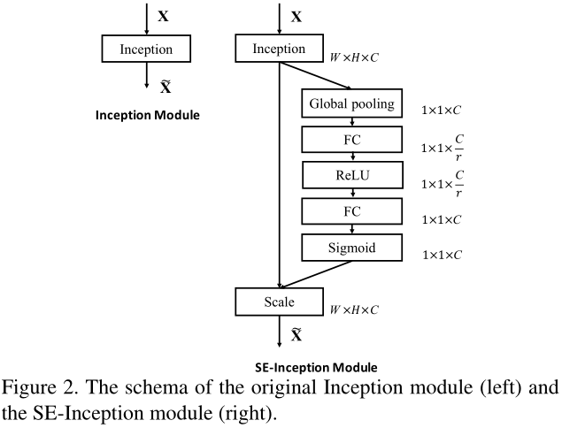  
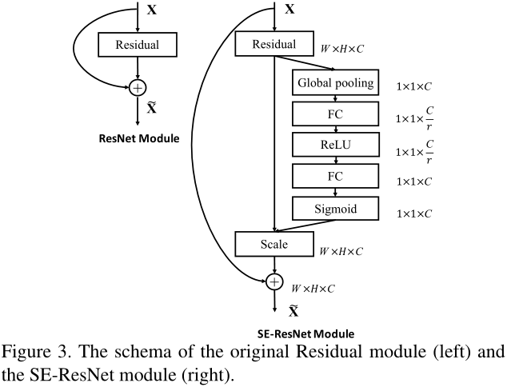  

### 4. Model and Computational Complexity
对添加了SE block的网络的具体配置见表1。  
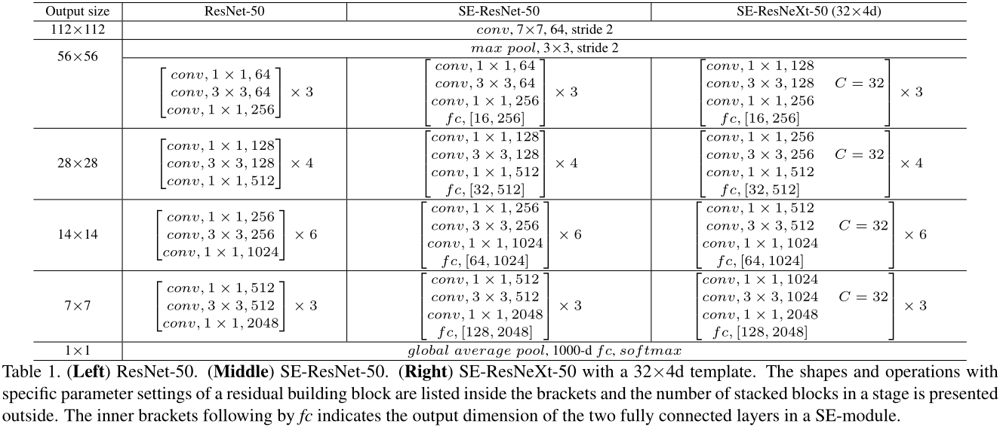  
每个SE block中包含一个全局平均池化操作，两个小的全连接层，最后一个简单的逐通道缩放操作，全部合起来在ResNet-50的基础上增加了0.26%的计算量。
新添加的参数量主要来自于两个全连接层，ResNet-50增加了约10%，大多数都是来自最后阶段，此时的通道维度很大。
但是实验发现如果去掉最后阶段的SE block性能并没有太大影响，而新增加的参数量则会减小到约4%。  

### 5. Implementation
基本都是常规处理和训练设置。值得注意的是采用了Relay backpropagation for effective learning of deep convolutional neural networks
中的数据平衡策略。  

### 6. Experiments
#### 6.1 ImageNet Classification
本文实验的不同网络的配置见表2，训练曲线见图4-6。  
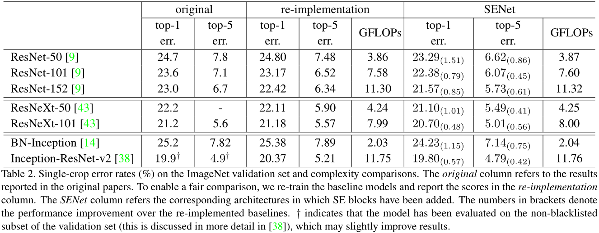  
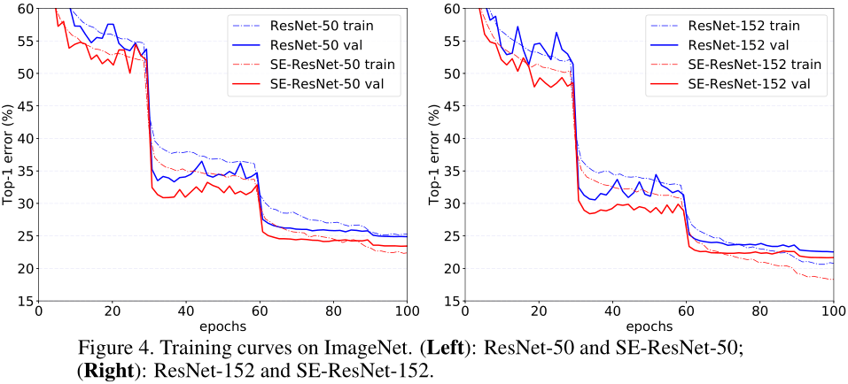  
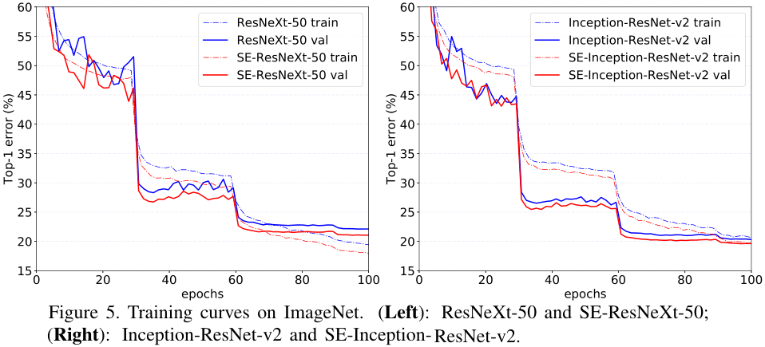  
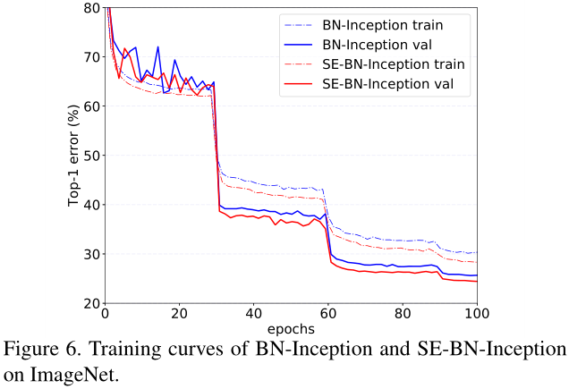  
在ImageNet验证集上不同网络的表现见表3。  
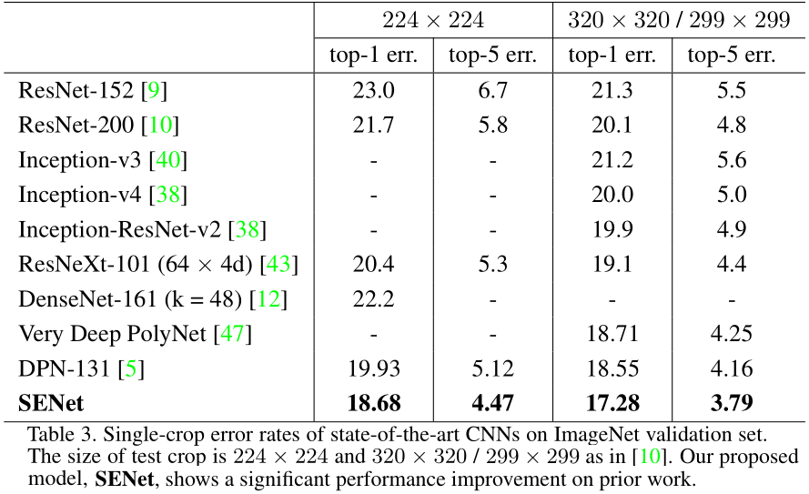  
#### 6.2 Scene Classification
不同网络的性能对比见表4。  
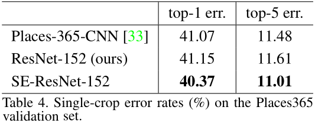  
#### 6.3 Analysis and Discussion
**Reduction ratio**  
3.2中讨论的降维系数是超参数，它不同取值对网络性能的影响见表5。  
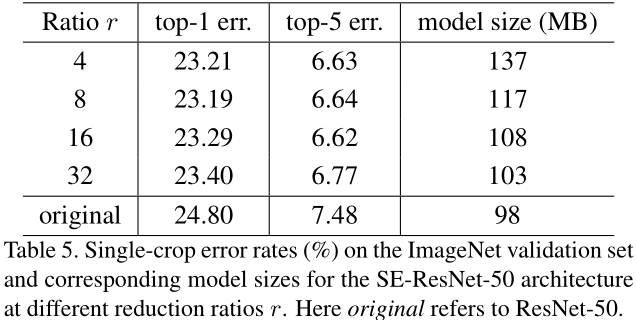  
为了权衡准确率与复杂度，本文选取r=16。  
**The role of Excitation**  
考察自门限（self-gating）excitation机制。选取四个类别（如图7），分别考察不同层中的SE block的平均激活值，其分布如图8所示。  
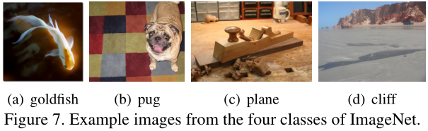  
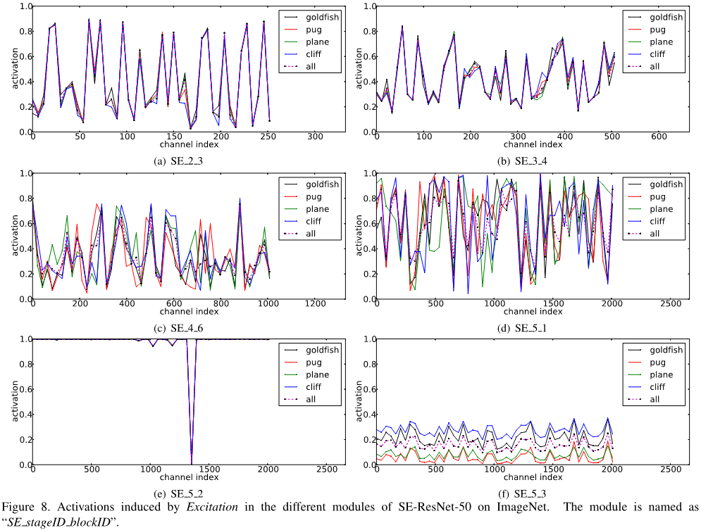  
通过观察图8中不同层SE block激活值的分布情况，发现1)前面层中的分布基本一样，说明这一阶段的特征是类别无关的；2)后续层中分布越来越类别相关，
每个类别对特征由不同的选择；3)SE_5_2和SE_5_3中的分布也基本一致，说明这两层对网络重新调整的重要性不高，可以去掉这两层中的SE block
以减少参数量，如第4章中所述。  

### 7. Conclusion
SE block根据输入动态调整各通道的特征，增强网络的表示能力。另外也可以用于辅助网络修剪/压缩的工作。
