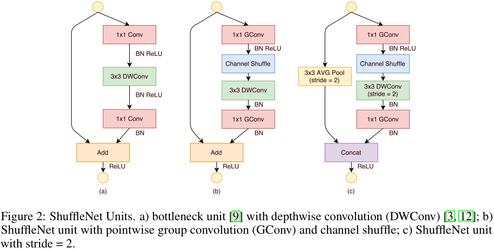

# ShuffleNet
[ShuffleNet: An Extremely Efficient Convolutional Neural Network for Mobile Devices](https://arxiv.org/abs/1707.01083)  
Xiangyu Zhang, Xinyu Zhou, Mengxiao Lin, Jian Sun  

### 摘要
本文提出一种计算效率极高的CNN架构——ShuffleNet，主要应用于计算能力有限（例如10-150 MFLOPs）的移动设备中。ShuffleNet架构中利用了两个新的操作，
逐点分组卷积（pointwise group convolution）和通道重排（channel shuffle），在保持准确率的前提下极大地减少计算量。
在ImageNet分类和MS COCO检测任务上的实验表明，ShuffleNet的性能比其他结构（例如MobileNet）更优越。ShuffleNet在基于ARM的移动设备中的实际运行速度
要比AlexNet快约13倍，且准确率基本保持不变。  

### 1. Introduction
本文主要聚焦于设计一种计算开支很小但准确率高的网络，主要应用于移动平台如无人机、机器人、手机等。之前的一些工作主要是对“基础”网络架构进行
修剪（pruning）、压缩（compressing）、低精度表示（low-bit representing）等处理来达到降低计算量的目的，而本文是要探索一种高效计算的基础网络。  
当前最先进的基础网络架构如Xception、[ResNeXt](https://github.com/binLearning/caffe_toolkit/tree/master/ResNeXt)在极小的网络中计算效率变低，
主要耗费在密集的1x1卷积计算上。本文提出使用逐点分组卷积（pointwise group convolution）替代1x1卷积来减小计算复杂度，
另为了消除其带来的副作用，使用通道重排（channel shuffle）来改进特征通道中的信息流动，基于这两个操作构建了高效计算的ShuffleNet。
在同样的计算开支下，ShuffleNet比其他流行的机构有更多的特征图通道数量，可以编码更多的信息，这对于很小的网络的性能是尤为重要的。  

### 2. Related Work
**Efficient Model Designs**  
在嵌入式设备上运行高质量深度神经网络的需求促进了对高效模型设计的研究。GoogLeNet在增加网络深度时随之增加的复杂度比简单堆叠卷积层的方式要低得多。
SqueezeNet可以在保持准确率的前提下大幅降低参数量和计算量。
[ResNet](https://github.com/binLearning/caffe_toolkit/tree/master/ResNet)中使用bottleneck结构来提高计算效率。
AlexNet中提出分组卷积是为了将模型分配到两个GPU中，在ResNeXt中被发现可以用于提高网络性能。Xception中提出的深度分离卷积
（depthwise separable convolution，逐通道卷积+全通道1x1卷积）是对Inception系列中分离卷积思想的推广。
MobileNet使用深度分离卷积构建轻量级模型获得当前最先进的结果。本文将分组卷积和深度分离卷积推广到一种新的形式。  
**Model Acceleration**  
这个方向主要是在保持预训练模型准确率的前提下对预测过程进行加速。有的方法是通过修剪网络连接或通道来减少预训练模型中的冗余连接。
量化（quantization）和因式分解（factorization）也可以减少冗余。还有一些方法并不是改变参数，而是用FFT或其他方法来优化卷积算法的实现以达到加速的目的。
蒸馏（distilling）将大模型中的知识迁移到小模型中，使小模型更易于训练。与上述方法相比，本文主要聚焦于设计更好的模型来提高性能，
而不是加速或迁移已有的模型。  

### 3. Approach
#### 3.1 Channel Shuffle for Group Convolutions
Xception和ResNeXt分别引进了深度分离卷积（depthwise separable convolution）和分组卷积（group convolution）来权衡模型表示能力与计算量。
但是这些设计都没有考虑其中的1x1卷积（也被称为逐点卷积(pointwise convolutions)），这部分也是需要很大的计算量的。举例来说，
ResNeXt中只有3x3卷积采用分组卷积，那么每个残差block中93.4%的乘加计算来自于逐点卷积，在极小的网络中逐点卷积会限制通道的数量，
进而影响到模型性能。  
为了解决这个问题，一个简单的解决方法就是在通道维度上应用稀疏连接，比如在1x1卷积上也采用分组卷积的方式。但是这样做会带来副作用：
输出中的每个通道数据只是由输入中同组的通道数据推导得到的（如图1(a)所示），这会阻碍信息在不同分组的通道间的流动，减弱网络的表示能力。  
  
如果让每个组的卷积可以获得其他组的输入数据（如图1(b)所示），那么输入/输出的各通道就是完全相关的。为了达到这个目的，可以将每组卷积的输出再细分，
然后将细分的子组分别传输到下一层的不同组中。这个操作可以由通道重排（channel shuffle）来实现：假设分为g个组进行卷积，
每组输出n个通道，那么输出的总通道数就是gxn，先将输出的维度变成(g,n)，然后转置，最后还原为nxg的数据即可，结果如图1(c)所示。
将通道重排后的数据作为下一层分组卷积的输入即可，这样的操作不要求两个分组卷积层有相同的分组数量。  
#### 3.2 ShuffleNet Unit
之前的网络（ResNeXt、Xception）只对3x3卷积进行分组/逐通道卷积，现在在1x1卷积（也称为pointwise convolution）上也应用分组卷积，
称为逐点分组卷积（1x1卷积+分组卷积），然后再加上通道重排操作，就可以在ResNet的基础上构建ShuffleNet，其单元结构见图2。  
  
在ResNet的基础上，首先将残差block中的3x3卷积层替换为逐通道卷积（depthwise convolution）（如图2(a)所示）。
然后将第一个1x1卷积层替换为逐点分组卷积加上通道重排的操作，这样就构成了ShuffleNet单元（如图(b)所示）。第二个逐点分组卷积是为了恢复原来的通道维度，
为了简单起见并没有在它后面添加通道重排的操作，这和添加时得到的结果基本相同。BN和非线性激活的使用和ResNet/ResNeXt中类似，
另外在逐层卷积后不使用ReLU也遵循了Xception。当空间维度减半时，在快捷连接（shortcut path）上添加尺寸3x3步幅2的平均池化层，
逐通道卷积步幅为2，最后将两者相加的操作替换为拼接，这样输出通道数自然就加倍了，所做修改如图2(c)所示。  
相比同样配置的ResNet和ResNeXt，ShuffleNet的计算量要低得多。假设输入数据大小为c\*h\*w，bottleneck层（1x1+3x3+1x1）通道数为m，
那么ResNet单元需要hw(2cm+9m\*m) FLOPs，ResNeXt需要hw(2cm+9m\*m/g) FLOPs，而ShuffleNet只需要hw(2cm/g+9m) FLOPs，其中g为分组数量。
也就是说在给定计算开支的情况下ShuffleNet可以包含更多特征映射，这对于小网络来说非常重要，因为很小的网络一般没有足够的通道数量来进行信息传输。  
逐通道卷积理论上有很低的计算量，但在低功率移动设备上很难有效实现，与密集运算相比计算/内存访问率要差，Xception论文中也提到了这个问题。
在ShuffleNet中故意只在bottleneck层（3x3卷积）上使用逐通道卷积以避免这种开支。  
#### 3.3 Network Architecture

