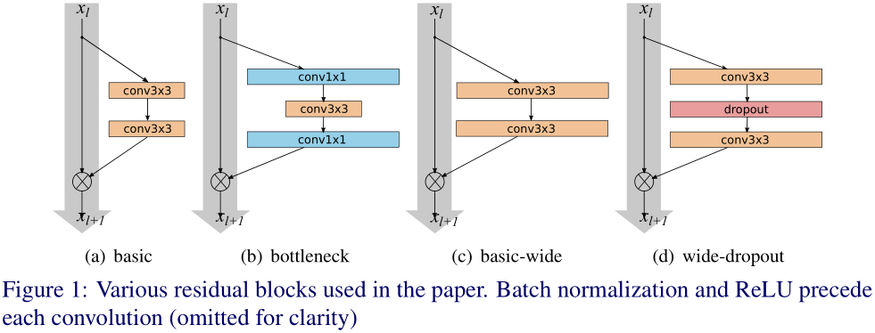

# WRN
[Wide Residual Networks](https://arxiv.org/abs/1605.07146)  
Sergey Zagoruyko, Nikos Komodakis  

### 摘要
深度残差网络可以扩展到上千层，并且仍然能够提升性能。但是，每提升1%的准确率就要付出将网络层数翻倍的代价，而极深层的残差网络对特征的重复利用逐渐减少
（diminishing feature reuse），这会使网络训练变得很慢。为了处理这个问题，本文提出一种新的架构——wide residual networks (WRNs)，
该架构减小残差网络的深度，增大网络的宽度。实验证明WRN要优于窄但极深的网络，16层的WRN在准确率和效率方面要优于之前所有的残差网络，
包括超过1000层的极深残差网络，WRN在CIFAR、SVHN、COCO上都取得了最佳的结果，在ImageNet上也有很大提升。官方实现（Torch）源码地址：
https://github.com/szagoruyko/wide-residual-networks 。  

### 1. Introduction
近几年在多项工作中都发现了使用深层网络的优势，但是训练深层网络存在一些难点，包括梯度消失/爆炸、退化现象等。多种技术有助于训练较深层的网络，
比如精心设计的初始化策略（msra等），更好的优化器，跳跃连接（skip connection），知识迁移（ knowledge transfer），逐层训练
（layer-wise training）等。  
最近的ResNet在多个任务上都取得了最佳的结果，相比于Inception架构，ResNet具有更好的泛化能力，也就是说它提取的特征可以用于迁移学习。
Inception-ResNet显示了残差连接可以加速深层网络的收敛速度，ResNet-v2考察了残差网络中激活函数的位置顺序，显示了恒等映射在残差网络中的重要性，
并且利用新的架构可以训练极深层的网络。Highway network也可以训练深层网络，它与ResNet最大的不同在于它的残差连接是参数门限形式的。  
之前的研究基本都是着眼于残差block中的激活函数位置顺序或者残差网络的深度。本文从另一个角度来提高残差网络性能。  
**Width vs depth in residual networks**  
ResNet为了在增加网络深度时保持模型包含较小参数量，将网络设计的很“窄（thin）”，甚至引入bottleneck block使block更窄。  
包含恒等映射的残差block有助于训练极深层网络，但同时也是残差网络的一个缺点。梯度反传时并不一定要通过残差block中带权值的支路（残差函数），
那么这些残差函数在训练时就学习不到任何信息，所以残差网络中可能只有一小部分block学习到有用的表示，大多数block对最终的预测贡献甚少。
这个问题在Highway network被称为diminishing feature reuse。随机深度ResNet通过在训练时随机丢弃ResNet中的部分层来解决这个问题，
这种方法可以视为dropout的特例，而该方法的有效性也证明了上述假设是正确的。  
本文工作基于[ResNet-v2](https://github.com/binLearning/caffe_toolkit/tree/master/ResNet-v2)，主要考察残差block的宽度。
本文实验显示， **适当的增加ResNet中block的宽度比增加网络深度可以更有效的提升性能 ，这说明残差网络的能力主要由残差block提供，
网络深度只有补充性的作用。**  
**Use of dropout in ResNet blocks**   
Dropout多用于网络中包含大量参数的最终几层（一般是全连接层）来防止特征相互适应（feature coadaptation）以及过拟合。
但dropout逐渐被batch normalization (BN)取代，BN也有正则化的效果，并且实验证明使用BN的网络比使用dropout的网络有更高的准确率。
在本文中，加宽的残差block包含大量参数，我们使用dropout来防止过拟合。ResNet-v2中将dropout加到快捷连接支路上发现性能变差，
我们认为dropout应该添加到残差函数支路中，实验证明该方法可以提升网络性能。  

### 2. Wide residual networks
在ResNet-v2中残差网络有两种形式的block：  
**basic** —— 两个相连的3x3卷积层，预激活（pre-activation）形式，如图1(a)所示  
**bottleneck** —— 一个3x3卷积层，前后各一个1x1卷积层，如图1(b)所示  
bottleneck block是为了在增加层数时减少block的计算量，也就是使得block更窄，而我们要考察的是加宽block的效果，所以不考虑bottleneck block，
在本文架构中只使用basic形式。  
  

