# WRN
[Wide Residual Networks](https://arxiv.org/abs/1605.07146)  
Sergey Zagoruyko, Nikos Komodakis  

### 摘要
深度残差网络可以扩展到上千层，并且仍然能够提升性能。但是，每提升1%的准确率就要付出将网络层数翻倍的代价，而极深层的残差网络对特征的重复利用逐渐减少
（diminishing feature reuse），这会使网络训练变得很慢。为了处理这个问题，本文提出一种新的架构——wide residual networks (WRNs)，
该架构减小残差网络的深度，增大网络的宽度。实验证明WRN要优于窄但极深的网络，16层的WRN在准确率和效率方面要优于之前所有的残差网络，
包括超过1000层的极深残差网络，WRN在CIFAR、SVHN、COCO上都取得了最佳的结果，在ImageNet上也有很大提升。官方实现（Torch）源码地址：
https://github.com/szagoruyko/wide-residual-networks 。  

### 1. Introduction
近几年在多项工作中都发现了使用深层网络的优势，但是训练深层网络存在一些难点，包括梯度消失/爆炸、退化现象等。多种技术有助于训练较深层的网络，
比如精心设计的初始化策略（msra等），更好的优化器，跳跃连接（skip connection），知识迁移（knowledge transfer），逐层训练
（layer-wise training）等。  
最近的ResNet在多个任务上都取得了最佳的结果，相比于Inception架构，ResNet具有更好的泛化能力，也就是说它提取的特征可以用于迁移学习。
Inception-ResNet显示了残差连接可以加速深层网络的收敛速度，ResNet-v2考察了残差网络中激活函数的位置顺序，显示了恒等映射在残差网络中的重要性，
并且利用新的架构可以训练极深层的网络。Highway network也可以训练深层网络，它与ResNet最大的不同在于它的残差连接是参数门限形式的。  
之前的研究基本都是着眼于残差block中的激活函数位置顺序或者残差网络的深度。本文从另一个角度来提高残差网络性能。  
**Width vs depth in residual networks**  
ResNet为了在增加网络深度时保持模型包含较小参数量，将网络设计的很“窄（thin）”，甚至引入bottleneck block使block更窄。  
包含恒等映射的残差block有助于训练极深层网络，但同时也是残差网络的一个缺点。梯度反传时并不一定要通过残差block中带权值的支路（残差函数），
那么这些残差函数在训练时就学习不到任何信息，所以残差网络中可能只有一小部分block学习到有用的表示，大多数block对最终的预测贡献甚少。
这个问题在Highway network被称为diminishing feature reuse。随机深度ResNet通过在训练时随机丢弃ResNet中的部分层来解决这个问题，
这种方法可以视为dropout的特例，而该方法的有效性也证明了上述假设是正确的。  
本文工作基于[ResNet-v2](https://github.com/binLearning/caffe_toolkit/tree/master/ResNet-v2)，主要考察残差block的宽度。
本文实验显示， **适当的增加ResNet中block的宽度比增加网络深度可以更有效的提升性能 ，这说明残差网络的能力主要由残差block提供，
网络深度只有补充性的作用。**  
**Use of dropout in ResNet blocks**   
Dropout多用于网络中包含大量参数的最终几层（一般是全连接层）来防止特征相互适应（feature coadaptation）以及过拟合。
但dropout逐渐被batch normalization (BN)取代，BN也有正则化的效果，并且实验证明使用BN的网络比使用dropout的网络有更高的准确率。
在本文中，加宽的残差block包含大量参数，我们使用dropout来防止过拟合。ResNet-v2中将dropout加到快捷连接支路上发现性能变差，
我们认为dropout应该添加到残差函数支路中，实验证明该方法可以提升网络性能。  

### 2. Wide residual networks
在ResNet-v2中残差网络有两种形式的block：  
**basic** —— 两个相连的3x3卷积层，预激活（pre-activation）形式，如图1(a)所示  
**bottleneck** —— 一个3x3卷积层，前后各一个1x1卷积层，如图1(b)所示  
bottleneck block是为了在增加层数时减少block的计算量，也就是使得block更窄，而我们要考察的是加宽block的效果，所以不考虑bottleneck block，
在本文架构中只使用basic形式。  
  
有三种提升残差block表示能力的方法：  
• 向每个block中增加更多的卷积层  
• 通过增加特征图数量来加宽卷积层  
• 增大卷积层的滤波器尺寸  
VGG、Inception-v4中显示小尺寸的滤波器更有效，所以本文不考虑尺寸大于3x3的卷积核。引入两个因子：深度因子l，表示一个block中包含的卷积层数量；
宽度因子k，卷积层输出特征图数量的倍数，那么basic block对应的l=2，k=1。图1(a)、(c)分别展示了basic block和加宽的basic block。  
表1中展示了本文提出的残差网络的具体配置，其中宽度因子k用来控制残差block的宽度。  
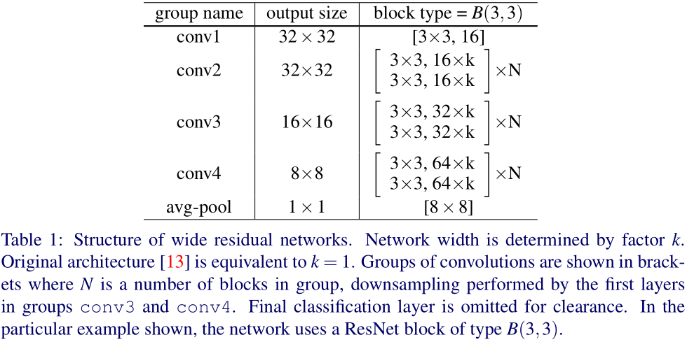  
#### 2.1 Type of convolutions in residual block
用B(M)来表示残差block的结构，其中M表示卷积层列表，以滤波器尺寸来代表卷积层。为了考察3x3卷积层的重要性，以及它是否可以被其他形式的卷积取代，
本文试验了多种形式的卷积组合：  
1. B(3,3) - original basic block  
2. B(3,1,3) - with one extra 1x1 layer  
3. B(1,3,1) - with the same dimensionality of all convolutions, straightened bottleneck  
4. B(1,3) - the network has alternating 1x1-3x3 convolutions everywhere  
5. B(3,1) - similar idea to the previous block  
6. B(3,1,1) - Network-in-Network style block  
#### 2.2 Number of convolutional layers per residual block
考察深度因子l对模型性能的影响，为了保持网络复杂度基本不变，需要同时改变l和d（d表示block的总数），也就是说增大l时应该减小d。  
#### 2.3 Width of residual blocks
考察宽度因子k，当block深度因子l或者block总数d增大时，模型参数量也线性增加；而宽度因子k增大时，参数量和计算复杂度会增加k的平方倍。
即使这样，计算加宽的网络也比窄但极深的网络更加高效，因为GPU在并行计算大的张量时更加高效。  
ResNet之前的网络架构都是比较宽的，比如Inception和VGG。  
本文以WRN-n-k表示包含n个卷积层且宽度因子为k的WRN，也有可能加上block的形式，比如WRN-40-2-B(3,3)。  
#### 2.4 Dropout in residual blocks
加宽block会增加网络的参数数量，所以要使用正则化方法。之前的残差网络使用BN来提供正则化的效果，但仍然需要大量的数据增广操作。
本文在残差函数支路中加入dropout（如图1(d)所示）来避免过拟合。在极深层残差网络中这样应该可以解决特征重复利用逐渐减少的问题，
因为dropout的加入可以强使不同的残差block学习表示。  

### 3. Experimental results
分别在CIFAR-10、CIFAR-100、SVHN和ImageNet数据集上进行实验。  
**Type of convolutions in a block**  
不同形式的卷积组合的性能见表2，可以看出，具有相同参数量的block的性能基本一样，所以后面的实验全部选取只包含3x3卷积层的形式。  
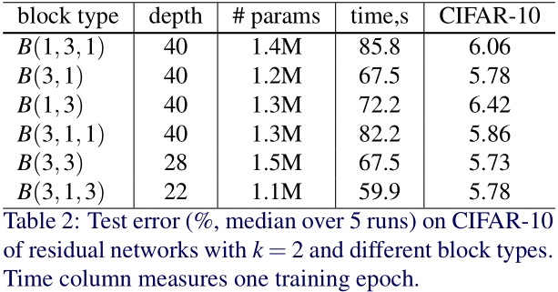  
**Number of convolutions per block**  
不同的深度因子l的性能见表3。B(3,3,3)和B(3,3,3,3)比B(3,3)性能差，可能是因为网络中的残差连接减少（参考2.2），使得网络难以优化。  
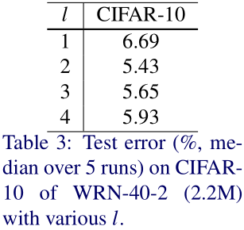  
**Width of residual blocks**   
考察不同的k和网络深度的组合，具体性能见表4。  
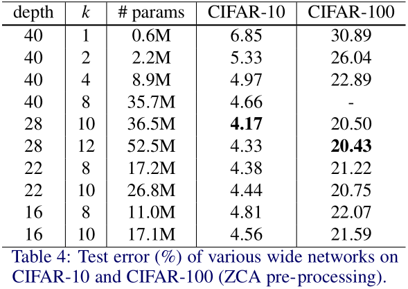  
表5展示了不同网络的性能比较，图2显示了两个代表性网络的训练曲线。  
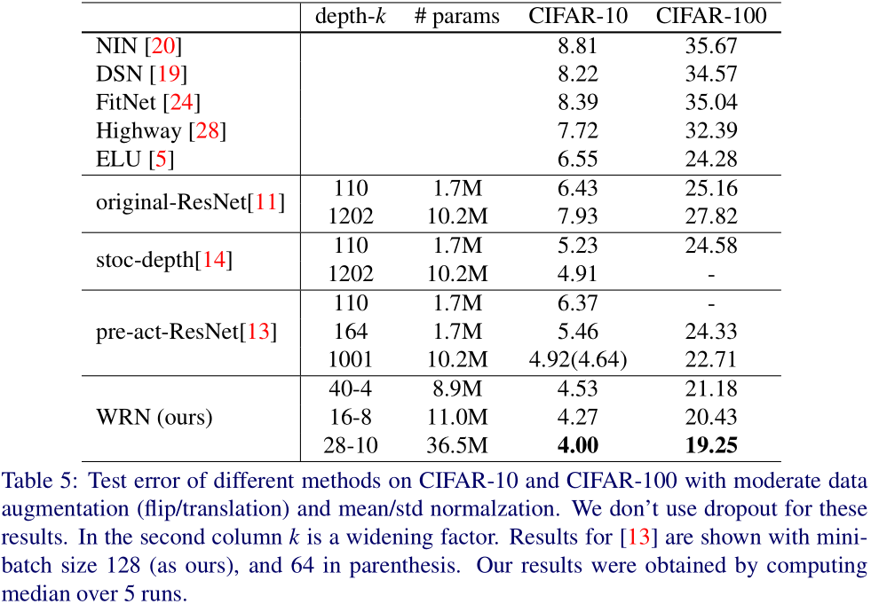  
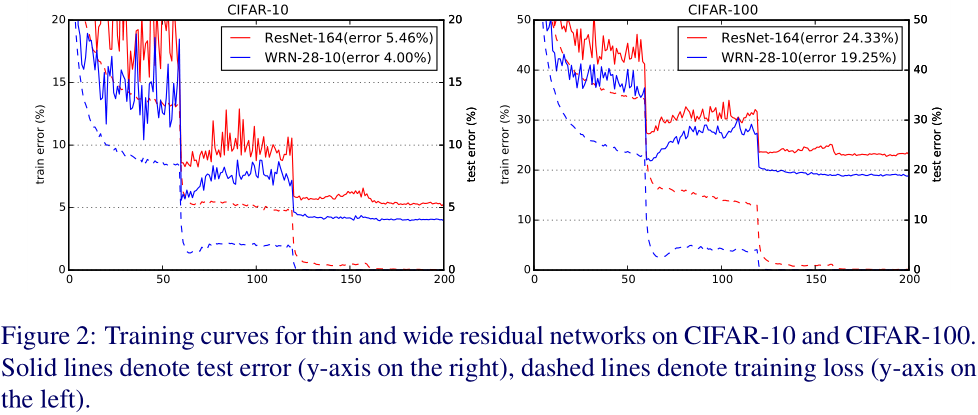  
尽管先前的一些工作表明深度具有正则化的效果，而宽度则会导致过拟合，但是我们成功训练出来比1001层ResNet参数量还要多的模型，训练耗时更短，
性能也更好。  
总结上述实验结果：  
• 加宽不同深度的残差网络都可以提升性能  
• 在参数量过多和需要更强的正则化方法之前，增加深度和宽度都有助于提升性能  
• 深度好像并没有正则化的作用，具有相同参数量的宽且浅网络可以学习到相当或更好的表示。此外，宽网络可以训练出数倍于窄网络参数量的模型，
窄网络的深度需要加倍才能得到相同的结果，这使得训练几乎不可行。  
**Dropout in residual blocks**  
考察dropout的作用，具体性能见表6。  
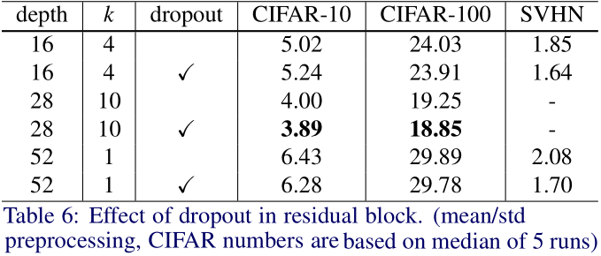  
我们发现在训练残差网络时，在第一次和第二次下调学习率之间的时间段，验证集损失和误差都会震荡走高，这可能是因为权值衰减（weight decay），
但是调低权值衰减系数会使得准确率大幅下降。dropout可以在大多数情况下缓解这个问题（见图2,3）。  
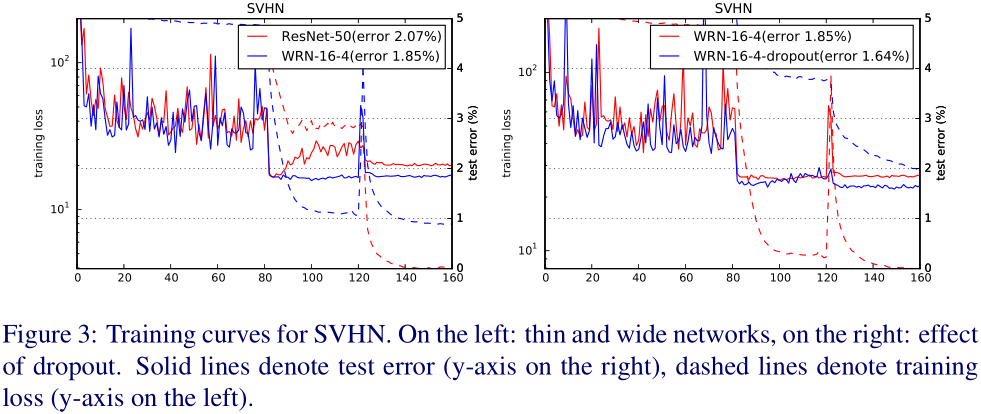  
尽管网络中使用了BN，dropout仍然是一个有效的正则化方法。dropout可以和加宽方法互补使用来进一步提升模型性能。  
**ImageNet and COCO experiments**  
具体结果见表7-9。  
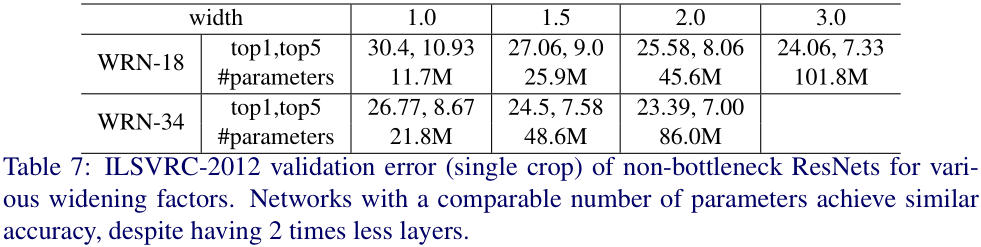  
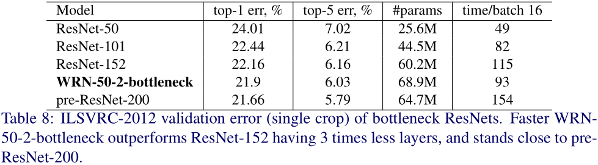  
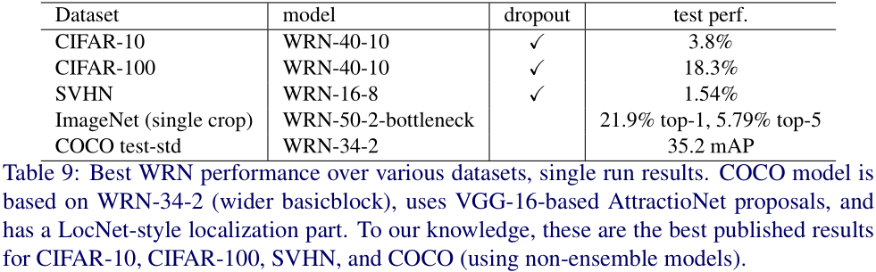  
**Computational efficiency**  
窄深且卷积核尺寸小的残差网络与GPU计算优势相悖。增加宽度可以提高计算效率，所以宽的网络通常更高效。考察不同的网络计算耗时如图4。  
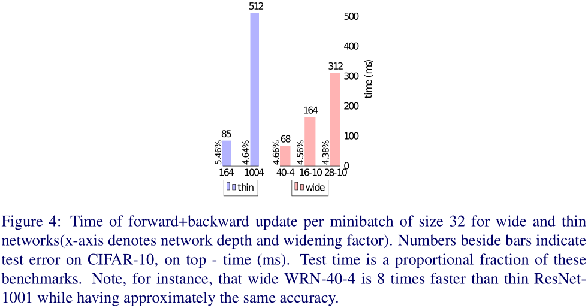  
**Implementation details**  
使用Torch实现，官方实现源码地址：https://github.com/szagoruyko/wide-residual-networks 。

### 4. Conclusions
本文主要考察了残差网络中的宽度以及dropout的使用。实验证明残差网络的能力主要由残差block提供，并不是极端的深度。另外，
WRN的训练在某些情况下会更快。
